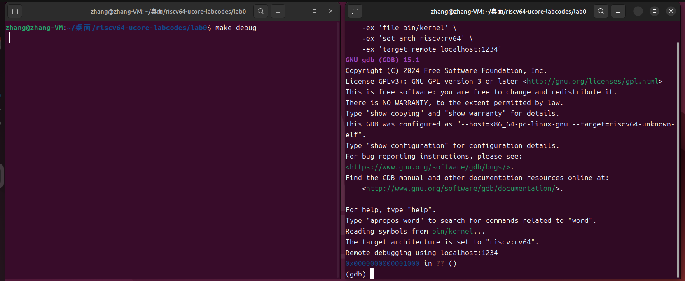

#Lab 0.5

## 知识点：Qemu 模拟器的启动流程

RISC-V 硬件加电后的一般执行过程可以分为以下几个阶段：

##### 1. **加电复位：** 

​	当系统加电时，RISC-V 处理器会进入复位状态。复位信号会清除所有寄存器和状态机，使系统处于一个干净的初始状态。

##### 2. **执行复位代码：**

​	这时处理器的PC会被初始化为复位向量地址（QEMU模拟器的是`0x1000` ），开始执行复位代码。复位代码主要作用是对系统的各个组件进行初始化，包括处理器、内存和外设的状态设置，这一过程确保计算机系统处于已知的稳定状态。

##### 3. **加载Bootloader：**

​	一旦复位代码完成初始化，QEMU 会将控制权移交给 Bootloader。QEMU 模拟的 RISC-V 处理器指定 Bootloader 加载的位置为 `0x80000000`，跳转后，OpenSBI 开始工作。此时，OpenSBI 会初始化更高层次的硬件功能，并准备启动操作系统内核。

##### 4. **加载操作系统：**

​	OpenSBI 会从内存中加载操作系统内核（跳转到第一条指令的地址`0x80200000`，也就是应用程序的入口地址），并且初始化所需的中断处理、内存管理等功能。一旦 OpenSBI 完成这些初始化，它会将控制权交给操作系统内核。

##### 5. **启动和执行：**

​	系统开始执行用户程序，处理器根据指令流进行运算和逻辑处理。

## 练习一：使用GDB验证启动流程

​	在本练习中，为了熟悉 qemu 和 gdb 进行调试的方法，我们重点调试了 QEMU 模拟的 RISC-V 计算机从加电开始运行到执行应用程序的第一条指令的过程，了解了 RISC-V 硬件加电后所执行的指令，以及各部分各阶段的具体功能。

​	首先进行理论分析，

​	接下来使用 `make debug` 和 `make gdb` 对 QEMU 进行调试。`make debug` 命令启动 QEMU 模拟器，使其以调试模式运行，并通过一个指定的端口监听 GDB 的连接，暂停运行，等待 GDB 发出的调试指令。`make gdb` 启动 GDB 并自动连接到 QEMU 的调试端口，之后可以随时在 GDB 控制端输入调试指令，如设置断点、查看寄存器或内存、单步执行等。



​	可以看到最后几行的信息如下。表明GDB 已成功连接到 QEMU 的调试接口，并且处理器的 PC 指向复位向量地址 `0x1000`，符合理论分析的结果。由于 GDB 没有符号信息，它无法显示源代码或函数名称，因此显示 `?? ()`。

```bash
Remote debugging using localhost:1234
0x0000000000001000 in ?? ()
```

​	然后使用 `x/10i $pc` 显示即将执行的 10 条指令，逐行分析作用，得到：
```bash
(gdb) x/10i $pc
=> 0x1000:	auipc	t0,0x0
   0x1004:	addi	a2,t0,40
   0x1008:	csrr	a0,mhartid
   0x100c:	ld	a1,32(t0)
   0x1010:	ld	t0,24(t0)
   0x1014:	jr	t0
   0x1018:	unimp
   0x101a:	.insn	2, 0x8000
   0x101c:	unimp
   0x101e:	unimp
```

`0x1000: auipc t0, 0x0`：将当前的 PC存入寄存器 `t0` 中。

`0x1004: addi a2, t0, 40`：将寄存器 `t0` 的值加上立即数 `40`，结果存入寄存器 `a2`。

`0x1008: csrr a0, mhartid`：从控制状态寄存器（CSR）`mhartid` 中读取当前硬件线程 ID，并将其存入 `a0`。

`0x100c: ld a1, 32(t0)`：从内存地址 `0x1020` 处加载一个 64 位数据，存入 `a1`。

`0x1010: ld t0, 24(t0)`：从内存地址 `0x1018` 处加载一个 64 位数据，存入 `t0`。

`0x1014: jr t0`：跳转到 `t0` 中存储的地址，结束当前复位代码的执行，进入新的执行阶段。

`0x1018: unimp` & `0x101c: unimp` & `0x101e: unimp`：非法指令，表示当前处理器不支持此指令。

`0x101a: .insn 2, 0x8000`：自定义指令，表示根据特定格式定义的汇编指令。

​	于是使用`si`指令执行代码到`0x1014`的位置，再使用`info r t0`查看此时的寄存器`t0`的值。

```bash
(gdb) si
0x0000000000001014 in ?? ()
(gdb) info r t0
t0             0x80000000	2147483648
```

说明此时已运行至复位代码的尾部，并且即将通过 `jr t0` 跳转到 `0x80000000`，即 Bootloader 的起始位置。与之前的理论分析相符。

​	接下来可以继续查看跳转后的指令，探索 OpenSBI 进行的工作：

```bash
(gdb) x/10i 0x80000000
=> 0x80000000:	add	s0,a0,zero
   0x80000004:	add	s1,a1,zero
   0x80000008:	add	s2,a2,zero
   0x8000000c:	jal	0x80000668
   0x80000010:	add	a6,a0,zero
   0x80000014:	add	a0,s0,zero
   0x80000018:	add	a1,s1,zero
   0x8000001c:	add	a2,s2,zero
   0x80000020:	li	a7,-1
   0x80000022:	beq	a6,a7,0x8000002a
```

这段代码是 Bootloader 的早期部分，它负责保存初始状态的寄存器，准备跳转到核心的启动代码执行，加载或初始化更多硬件资源等。

​	由于程序较复杂，此处不再一一调试，使用`break *0x80200000`和`continue`直接观察 `0x80200000`是否符合理论，为应用程序的入口地址：

```bash
(gdb) x/10i $pc
   0x80200000 <kern_entry>:	    auipc	sp,0x3
   0x80200004 <kern_entry+4>:	mv	    sp,sp
   0x80200008 <kern_entry+8>:	j	    0x8020000a <kern_init>
   0x8020000a <kern_init>:	    auipc	a0,0x3
   0x8020000e <kern_init+4>:	addi	a0,a0,-2
   0x80200012 <kern_init+8>:	auipc	a2,0x3
   0x80200016 <kern_init+12>:	addi	a2,a2,-10
   0x8020001a <kern_init+16>:	addi	sp,sp,-16
   0x8020001c <kern_init+18>:	li	    a1,0
   0x8020001e <kern_init+20>:	sub	    a2,a2,a0
```

​	在 `/lab0/obj/kernel.asm` 中， `kern_entry` 块等代码与 GDB 显示代码相一致。这说明 `0x80200000` 确实是内核的起始地址。

```assembly
	80200000:	00003117        auipc	sp,0x3
    80200004:	00010113        mv	    sp,sp

    tail kern_init
    80200008:	a009            j	8020000a <kern_init>

...

    8020000a:	00003517        auipc	a0,0x3
    8020000e:	ffe50513        addi	a0,a0,-2 # 80203008 <edata>
    80200012:	00003617        auipc	a2,0x3
    80200016:	ff660613        addi	a2,a2,-10 # 80203008 <edata>
int kern_init(void) {
    8020001a:	1141            addi	sp,sp,-16 # 80202ff0 <bootstack+0x1ff0>
    memset(edata, 0, end - edata);
    8020001c:	4581            li	    a1,0
    8020001e:	8e09            sub	    a2,a2,a0
```

