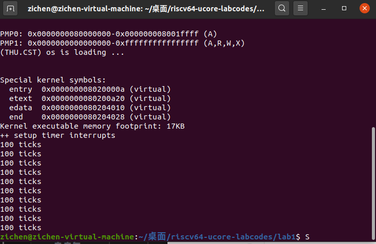
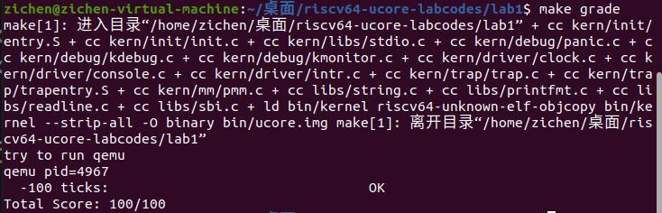

# Lab 1

## 练习一：理解内核启动中的程序入口操作

#### 1.`la sp, bootstacktop`

完成的操作：这条指令将 `bootstacktop` 的地址加载到栈指针寄存器 `sp` 中

目的：

* 初始化内核栈。在操作系统启动过程中，需要一个初始的栈来支持函数调用和局部变量存储。
* `bootstacktop` 是在代码末尾定义的标签，指向为内核栈分配的内存区域的顶部。
* 通过将栈指针设置到这个位置，确保内核有一个可用的栈空间来开始执行

#### 2.`tail kern_init`

完成的操作:跳转指令，会跳转到 `kern_init` 函数并开始执行

目的：

* 将控制权转移到内核的主初始化函数 `kern_init`。
* `tail` 指令是一种优化的跳转，它不会在栈上保存返回地址。这意味着 `kern_init` 将成为新的"主函数"，而不是作为子程序被调用。
* 这种方式可以节省栈空间，并且明确表示控制流不会返回到 `kern_entry`

操作系统启动的过程，需要 OpenSBI 将操作系统的二进制可执行文件加载到内存中，这个地方在内存中的什么位置就是由指令`la sp, bootstacktop`分配的，然后 OpenSBI 会把 CPU 的 PC 跳转到内存里的一个位置，开始执行内存中那个位置的指令，这个跳转的位置就是由指令`tail kern_init`实现的，`kern_init`才是程序的正式入口。


## 练习二：完善中断处理

`kern/trap/trap.c`函数中处理时钟中断部分的代码完善如下：

```c
void interrupt_handler(struct trapframe *tf) {
    intptr_t cause = (tf->cause << 1) >> 1;
    switch (cause) {
        ...
        case IRQ_S_TIMER:
            // "All bits besides SSIP and USIP in the sip register are
            // read-only." -- privileged spec1.9.1, 4.1.4, p59
            // In fact, Call sbi_set_timer will clear STIP, or you can clear it
            // directly.
            // cprintf("Supervisor timer interrupt\n");
             /* LAB1 EXERCISE2   YOUR CODE : 2211447 */
            /*(1)设置下次时钟中断- clock_set_next_event()
             *(2)计数器（ticks）加一
             *(3)当计数器加到100的时候，我们会输出一个`100ticks`表示我们触发了100次时钟中断，同时打印次数（num）加一
            * (4)判断打印次数，当打印次数为10时，调用<sbi.h>中的关机函数关机
            */
            clock_set_next_event(); 
            ticks++;
            if(ticks==TICK_NUM) //计数器加到100
            {
                print_ticks();
                num++;
                ticks=0;    //ticks归0
                if(num==10)
                {
                    sbi_shutdown();
                }
            }
            break;
        ...
        default:
            print_trapframe(tf);
            break;
    }
}
```

定时器中断中断处理的过程:

- `case IRQ_S_TIMER`：当程序发生定时器中断时，触发`interrupt_handler`函数，通过`switch(case)`语句进入到`IRQ_S_TIMER`分支。
- `clock_set_next_event()`：由于 OpenSBI 提供的接口一次只能设置一个时钟中断事件，所以一开始只设置一个时钟中断，之后每次发生时钟中断的时候，调用`clock_set_next_event()`函数设置下一次的时钟中断。
- `ticks++`：作为计数器记录代码中断次数。
- `if(ticks==TICK_NUM)`及其内部代码块：实现主要逻辑。
  - 计数器加到100时输出 “100ticks” ，表示触发了100次时钟中断，同时打印次数加一。
  - 当打印次数为10时，调用`<sbi.h>`中的关机函数`sbi_shutdown()`关机。
  - 需要特别注意的是，每触发了100次时钟中断后，需要将 ticks 重新归0。

使用`make qemu`命令运行系统，得到如下结果：



运行后看到每隔1秒便会输出一次”100 ticks”，共输出10行。


## Challenge1：描述与理解中断流程

中断发生有以下几种情况：

* 异常(Exception)，指在执行一条指令的过程中发生了错误
* 陷入(Trap)，指我们主动通过一条指令停下来，并跳转到处理函数
* 外部中断(Interrupt)，简称中断，指的是 CPU 的执行过程被外设发来的信号打断

在RISC-V架构中有一个“中断地址向量表（stevc）”，中断向量表的作用就是把不同种类的中断映射到对应的中断处理程序（假如只有一套处理方法，就可以直接映射到这唯一的处理方法上）

#### 中断处理过程：

1. 异常发生，处理器检测到异常，当前执行的指令会被中断。
2. 调用 `SAVE_ALL` 宏保存当前的寄存器状态到栈中。这一步确保在处理中断时，CPU 的状态可以在完成处理后恢复。
3. 执行`move a0, sp` 将当前栈指针的值传递到 `a0` 寄存器。
4. `jal trap` 跳转到中断处理程序 `trap`处理具体的中断或异常。
5. 一旦 `trap` 函数执行完毕，控制权将返回到 `__alltraps` 中的下一行，即：`__trapret` 标签中的指令。
6. 在 `__trapret` 标签中，调用 `RESTORE_ALL` 宏，从栈中恢复之前保存的寄存器状态，CPU 的状态能够恢复到中断发生前的状态。
7. `sret` 指令用于从超级用户模式返回到用户模式，完成中断处理并继续执行之前的程序。

#### `mov a0，sp`的目的：

`sp`是在`kern/trap/trap.h`中声明的栈指针，该指令执行后栈指针`sp`的值将复制保存到`a0`中，`a0`的值可以传递参数给中断处理函数`trap`使用。

#### `SAVE_ALL`寄存器保存在栈中的位置：

在`SAVA_ALL`宏中定义，下面在代码块中以注释的形式说明：

```assembly
 .macro SAVE_ALL   #开始SAVE_ALL宏定义

    csrw sscratch, sp   #保存 sp 到 sscratch 寄存器能够确保当需要进行上下文切换
                        #或异常处理时，程序能够知道原来的栈位置，从而进行正确的恢复和处理

    addi sp, sp, -36 * REGBYTES     #现在可以开始‘肆无忌惮’地使用栈指针来预留寄存器位置
    #将当前sp的位置更新为——栈中，向前36个寄存器大小的位置，即在栈中预留出36个寄存器的空间用于保存中断时寄存器的值
    # save x registers
    STORE x0, 0*REGBYTES(sp)    #将寄存器 x0 的值存储在 sp 当前指向的地址
    STORE x1, 1*REGBYTES(sp)    #将寄存器 x1 的值存储在 sp + 1*REGBYTES 的地址
    STORE x3, 3*REGBYTES(sp)    #……以此类推
    STORE x4, 4*REGBYTES(sp)
    STORE x5, 5*REGBYTES(sp)
    STORE x6, 6*REGBYTES(sp)
    STORE x7, 7*REGBYTES(sp)
    STORE x8, 8*REGBYTES(sp)
    STORE x9, 9*REGBYTES(sp)
    STORE x10, 10*REGBYTES(sp)
    STORE x11, 11*REGBYTES(sp)
    STORE x12, 12*REGBYTES(sp)
    STORE x13, 13*REGBYTES(sp)
```

#### 是否需要保存所有寄存器的值？

有的情况需要，有的情况不需要（当前 ucore 中提供的代码是所有中断都保存了所有寄存器的值）：

在实际中，中断可能来自用户态（U-Mode），也可能来自内核态（S-Mode）。
如果是用户态中断，那么此时的栈指针`sp`指向的是用户栈；如果是内核态中断，那么`sp`指向的是内核栈。对于内核态中断来说，直接使用`sp`就可以了，但对于用户态中断，我们需要在不破坏通用寄存器的情况下，切换`sp`到内核栈，这种情况下就需要保存所有通用寄存器的值。

如下面的一段来自网络的代码，就展示了这个过程：

```assembly
.macro SAVE_ALL
    csrrw sp, sscratch, sp
    bnez sp, trap_from_user  #判断中断来源
trap_from_kernel:
    csrr sp, sscratch
trap_from_user:
    addi sp, sp, -36*XLENB
    # save x registers except x2 (sp)
    STORE x1, 1
    STORE x3, 3
    STORE x4, 4
    STORE x5, 5
    STORE x6, 6
```


## Challenge2：理解上下文切换机制

#### `csrw sscratch, sp`实现的操作：

将当前的栈指针`sp` 的值写入到 `sscratch` 寄存器中。这是为了在处理过程中保存用户栈指针，以便在需要时可以恢复。`sscratch` 用于存储上下文切换前的状态.

#### `csrrw s0, sscratch, x0`实现的操作：

将 sscratch 的值写入 s0 并将 x0（恒为零）写入 sscratch。这样做的目的是在进行中断异常处理时，一旦再次出现异常，可以通过检查 sscratch 的值（如果是0）来确定这次异常是从内核中发生的>

#### 为什么不还原状态寄存器的值？

* store这些状态是是因为在`trap`程序部分处理异常时需要用到这些寄存器中保存的各种状态的值
* 在下一次（或许和当前的进程毫不相关）trap发生时，这些csr的值会被统一更新，就算不恢复也不影响下一次使用
* `csr`记录的值是提供给中断处理使用的，而不是提供给原本正在运行（中断发生时正在运行）的程序使用的

## Challenge3：完善异常中断

该Challenge要求编程完善异常处理函数中非法指令异常和断点异常处理的相关代码，简单输出异常类型和异常指令触发地址。填充代码如下：

```c
void exception_handler(struct trapframe *tf) {
    switch (tf->cause) {
        ...
        case CAUSE_ILLEGAL_INSTRUCTION:
             // 非法指令异常处理
             /* LAB1 CHALLENGE3   YOUR CODE : 2211447 */
            /*(1)输出指令异常类型（ Illegal instruction）
             *(2)输出异常指令地址
             *(3)更新 tf->epc寄存器
            */
            //调用cprintf函数输出指令异常类型
            cprintf("Exception Type:Illegal instruction\n");   
            //epc记录的是触发中断的那条指令的地址，此处格式字符串占位符%08x表示以16进制输出，且宽度至少8个字符
            cprintf("Illegal instruction caught at 0x%08x\n",tf->epc);  //tf是trap frame结构体
            tf->epc+=4; //更新epc到下一条指令，以便中断后返回继续执行程序
            
            break;
            
        case CAUSE_BREAKPOINT:
            //断点异常处理
            /* LAB1 CHALLLENGE3   YOUR CODE : 2211447 */
            /*(1)输出指令异常类型（ breakpoint）
             *(2)输出异常指令地址
             *(3)更新 tf->epc寄存器
            */
            cprintf("Exception type: breakpoint\n");
            cprintf("ebreak caught at 0x%08x\n",tf->epc);
            tf->epc+=2; //断点指令只占2个字节
            
            break;
        ...
        default:
            print_trapframe(tf);
            break;
    }
}
```

实现过程：

- `case CAUSE_ILLEGAL_INSTRUCTION`：发生非法指令异常时，触发`exception_handler`函数，通过switch case语句，进入到`CAUSE_ILLEGAL_INSTRUCTION`分支。
- `cprintf("Exception Type:Illegal instruction\n")`：调用`cprintf`函数输出指令异常类型，指明是非法指令异常。
- `cprintf("Illegal instruction caught at 0x%08x\n",tf->epc)`：输出异常指令地址。此处 tf 指的是是 trap frame 结构体， epc 记录着触发异常的那条指令的地址，这里采用格式字符串输出异常指令地址，其中占位符 %08x 表示以16进制输出，且宽度至少8个字符。
- `tf->epc+=4`：更新 epc 到下一条指令，以便中断处理完成后返回到触发中断的下一条指令处，继续执行后续程序。
- `case CAUSE_BREAKPOINT`：断点异常处理的代码与非法指令异常处理大致相同，唯一需要注意的一定是，断点指令只占2个字节，因此最后更新 `tf->epc`寄存器的指令应为`tf->epc+=2`。

实验评估：

​	执行`make grade`命令，对代码进行评估。评估Score 100/100，验证了上述代码的正确性。



