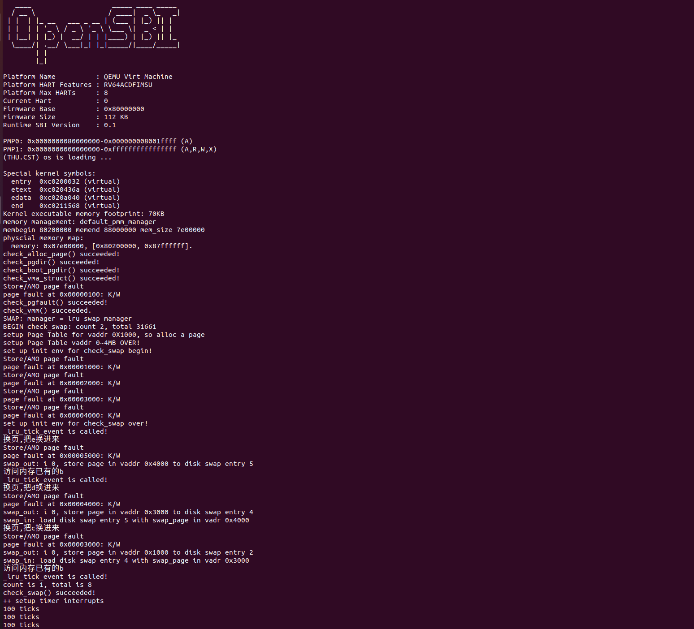

### 练习1：理解基于FIFO的页面替换算法（思考题）

##### swap_fifo.c

1. `_fifo_init_mm` 
   初始化函数，初始化FIFO替换算法的队列，并将内核的页面替换指针指向这个指针的相同位置

   ```c
   static int
    _fifo_init_mm(struct mm_struct *mm)
    {     
        list_init(&pra_list_head);
        mm->sm_priv = &pra_list_head;
        //cprintf(" mm->sm_priv %x in fifo_init_mm\n",mm->sm_priv);
        return 0;
    }
   ```

2. `_fifo_map_swappable`
   实现将传入的虚拟地址对应的页面换入队列中：
   `entry`是即将插入队列的页面的指针，head是指向FIFO队列头部的指针；`assert`函数检查确保即将插入的页面的指针和FIFO队列的指针都是有效的；使用 `list_add` 将 page 对应的节点 `entry` 添加到 `head` 后面，从而实现FIFO队列的效果，即最新的页面插入到队列末尾。

   ```c
   static int
    _fifo_map_swappable(struct mm_struct *mm, uintptr_t addr, struct Page *page, int swap_in)
    {
        list_entry_t *head=(list_entry_t*) mm->sm_priv;
        list_entry_t *entry=&(page->pra_page_link);
    
        assert(entry != NULL && head != NULL);
   
        list_add(head, entry);
        return 0;
    }
   ```

3. `_fifo_swap_out_victim`
   这个函数用于选择被替换出去的页面，即实现FIFO算法的核心逻辑——将最早进入的页面淘汰出去；
   传入内存管理结构体指针`mm`，包含了进程的内存管理信息，`ptr_page`是指向Page结构体的指针，用于返回选中的淘汰页面（即将选中的页面赋值到这个指针上，`in_tick`是用于确认FIFO策略的参数，要求为0。  

   ___

    两个断言函数，用于确保FIFO队列不为空，同时确认策略参数为0

   ```c
    assert(head != NULL);
    assert(in_tick==0);
   ```

   ___

    通过`list_prev`函数获取队列中最早进入队列的页面,如果返回值不为空，则将这个页面从队列中删掉，即替换出去，同时将这个页面的地址赋值给`ptr_page`，虽然是在替换页面但不是删除页面，页面的地址需要保存下来，否则这片内存的管理就失去信息了。

    ```c
   list_entry_t* entry = list_prev(head);
   if (entry != head) {
       list_del(entry);
       *ptr_page = le2page(entry, pra_page_link);
   } else {
       *ptr_page = NULL;
   }
    ```

4. `_fifo_check_swap`
   这个函数通过访问不同的虚拟页面地址，检查是否发生缺页（pgfault）并记录缺页次数，确保FIFO策略正确工作

   ___

   前面的几次断言确认a,b,c,d页面是在队列中的，依次检查页面c,a,d,b，向虚拟地址（如0x3000）写入值，缺页数不增加，则代表这些虚拟地址的页面在队列中 

   ```c
   cprintf("write Virt Page c in fifo_check_swap\n");
    *(unsigned char *)0x3000 = 0x0c;
    assert(pgfault_num==4);
    cprintf("write Virt Page a in fifo_check_swap\n");
    *(unsigned char *)0x1000 = 0x0a;
    assert(pgfault_num==4);
    cprintf("write Virt Page d in fifo_check_swap\n");
    *(unsigned char *)0x4000 = 0x0d;
    assert(pgfault_num==4);
    cprintf("write Virt Page b in fifo_check_swap\n");
    *(unsigned char *)0x2000 = 0x0b;
    assert(pgfault_num==4);
   ```

   ___

    向虚拟地址0x5000写入0x0e，判定缺页数是否增加为5，如果增加了则说明队列中发生了页面替换，而接着又向虚拟地址0x2000写入内容，（按照我们设想的逻辑）缺页数没有增加，则说明被替换的页面不是页面b

    ```c
   cprintf("write Virt Page e in fifo_check_swap\n");
   *(unsigned char *)0x5000 = 0x0e;
   assert(pgfault_num==5);
   cprintf("write Virt Page b in fifo_check_swap\n");
   *(unsigned char *)0x2000 = 0x0b;
   assert(pgfault_num==5);
    ```

   ___

    向虚拟地址0x1000写入信息，缺页数增加，说明刚才为了给页面e腾空间而替换出去的页面是页面a；向虚拟地址0x2000、0x3000、0x4000、0x5000写入，缺页数一直增加，到这里可以判断队列最多可以容纳4个虚拟页面，且测试开始前虚拟页面在队列中的顺序为：`a->b->c->d`，因为每访问一个页面就会有之前已经在队列中的页面被替换出去，并且已经实现了闭环。

    ```c
   *(unsigned char *)0x1000 = 0x0a;
   assert(pgfault_num==6);
   cprintf("write Virt Page b in fifo_check_swap\n");
   *(unsigned char *)0x2000 = 0x0b;
   assert(pgfault_num==7);
   cprintf("write Virt Page c in fifo_check_swap\n");
   *(unsigned char *)0x3000 = 0x0c;
   assert(pgfault_num==8);
   cprintf("write Virt Page d in fifo_check_swap\n");
   *(unsigned char *)0x4000 = 0x0d;
   assert(pgfault_num==9);
   cprintf("write Virt Page e in fifo_check_swap\n");
   *(unsigned char *)0x5000 = 0x0e;
   assert(pgfault_num==10);
    ```

5. `_fifo_init`
   FIFO算法初始化函数，但在这个函数里什么都不需要做，直接返回0：

   ```c
   static int
    _fifo_init(void)
    {
        return 0;
    }
   ```

6. `_fifo_set_unswappable`
   传入一个地址，这个函数可以用于将传入地址的页面设置为不可替换页面，但对于FIFO算法而言，ucore这部分功能并没有实现，即这个函数里什么都没有做，直接返回0：

   ```c
   static int
    _fifo_set_unswappable(struct mm_struct *mm, uintptr_t addr)
    {
        return 0;
    }
   ```

##### swap.c

这部分的代码不是FIFO算法的核心代码，但涉及了FIFO算法真正的调用过程  

7. `swap_init`
   用于初始化交换管理器，负责设置交换文件系统以及检查最大可用交换页面数和初始化页面置换算法

   ___

   调用 `swapfs_init`函数初始化交换文件系统，使系统可以存储和恢复页面：

   ```c
   swapfs_init();
   ```

   ___

   检查允许的最大交换页面数量是否在7和`MAX_SWAP_OFFSET_LIMIT`（这个全局变量在`swap.h`中定义为`1<<24`，即10进制的16777216）之间：

   ```c
   if (!(7 <= max_swap_offset &&
        max_swap_offset < MAX_SWAP_OFFSET_LIMIT)) {
        panic("bad max_swap_offset %08x.\n", max_swap_offset);
     }
   ```

   ___

   将页面置换管理器`sm`设置为`swap_manager_clock`，即使用时钟页面置换算法，实现页面替换,如果采用FIFO算法，在测试的时候需要在这个地方改成`swap_manager_fifo`，即在`swap_fifo.c`中包装好的好的管理器的名字

   ```c
   sm = &swap_manager_clock;
   ```

   ___

   调用替换算法的初始化函数，如果是使用FIFO算法则对应的是`swap_fifo.c`中的`_fifo_init`函数，但这个函数根据ucore的逻辑只返回0；如果得到初始化算法返回0的结果，则将页面替换算法完成的标志`swap_init_ok`设置为1，并执行`check_swap`函数，但要注意这个函数的功能与替换算法中的功能不是一样的

   ```c
   int r = sm->init();
     
    if (r == 0)
    {
        swap_init_ok = 1;
        cprintf("SWAP: manager = %s\n", sm->name);
        check_swap();
    }
   ```

   ___

8. `swap_out`
   换出页面函数：将内存中的n个页面交换到磁盘上，进入函数则马上进入一个n次的for循环，每次循环都处理一个页面的更换；完成更换后会返回成功更换的页面的数量，因为更换不是一定成功的，如果在处理某一个页面时，获取换出页面出现失败，则会中断整个函数，并返回当前成功更换的数量

   ___

   调用替换算法的选择更换对象函数，这个函数正常运行会在最后返回0，如果返回的不是0，则说明选择替换的页面过程出现错误

   ```c
    int r = sm->swap_out_victim(mm, &page, in_tick);
    if (r != 0) {
            cprintf("i %d, swap_out: call swap_out_victim failed\n",i);
            break;
    }
   ```

   ___

   调用`get_pte`函数，获取换出的页面的虚拟地址对应的页表项指针，并赋值给`ptep`，使用断言函数保证页表项是有效的，即获取的即将被换掉的页面在内存中是存在的

   ```c
    v=page->pra_vaddr; 
    pte_t *ptep = get_pte(mm->pgdir, v, 0);
    assert((*ptep & PTE_V) != 0);
   ```

   ___

   调用`swapfs_write`将页面内容保存到交换空间中，如果写入失败（swapfs_write 返回非零值），则输出错误信息，调用`map_swappable`函数（这个函数在FIFO中是`_fifo_map_swappable`）取消该页面的可交换状态，并跳过当前页面，继续处理下一个页面；
   如果成功写入，则显示交换到磁盘的虚拟地址和交换条目，并更新页表项，将页表项的物理地址更新为交换空间的偏移值（通过` page->pra_vaddr / PGSIZE + 1` 来计算交换空间的页号，左移8位表示写入的偏移量，左移8位后，页号被扩展为一个可以直接在交换文件中使用的偏移量）

   ```c
    if (swapfs_write( (page->pra_vaddr/PGSIZE+1)<<8, page) != 0) {
        cprintf("SWAP: failed to save\n");
        sm->map_swappable(mm, v, page, 0);
        continue;
    }
    else {
        cprintf("swap_out: i %d, store page in vaddr 0x%x to disk swap entry %d\n", i, v, page->pra_vaddr/PGSIZE+1);
        *ptep = (page->pra_vaddr/PGSIZE+1)<<8;
        free_page(page);
    }
   ```

   ___

   调用`tlb_invalidate`使被换出的页面的TLB快速缓存失效

   ```c
   tlb_invalidate(mm->pgdir, v);
   ```

9. `swap_in`
   换入页面函数：这个函数的作用是将指定虚拟地址对应的页面从交换空间中读取到物理内存中，并将页面指针存储在ptr_result中

   ___

   调用alloc_page为即将更换的页面从物理内存管理器（如伙伴系统）中分配物理内存空间（简单的说，就是为即将从磁盘或交换空间读取的数据提供实际存放的内存空间），并将其指针存储在result中，同时调用断言函数确保空间分配成功

   ```c
   struct Page *result = alloc_page();
    assert(result!=NULL);
   ```

   ___

   调用`get_pte`函数获取指定虚拟地址在页表中的页表项指针`ptep`，`mm->pgdir`是进程的页目录地址，此操作是为了获取这个将要被换入物理内存的页面的虚拟地址在交换空间中的页表条目，从而确定该页面的在交换空间中的位置

   ```c
   pte_t *ptep = get_pte(mm->pgdir, addr, 0);
   ```

   ___

   swapfs_read函数将交换空间中的页面读取到result指向的物理页面中（前面分配好的空间），函数正确执行会返回0，if语句中断言函数保证读取过程是正确执行的，否则会出发断言

   ```c
   if ((r = swapfs_read((*ptep), result)) != 0)
   {
   assert(r!=0);
   }
   ```

   ___

   完成页面写到分配好的物理空间中这一步后，将页面指针赋值给`ptr_result`，这样外部函数可以获取该页面，并返回 0 表示成功完成操作。

   ```c
   *ptr_result=result;
   return 0;
   ```

10. `check_content_access`
    这个函数会调用替换管理算法中的`check_swap`函数，使用FIFO算法时即对应`_fifo_check_swap`函数，而这个函数则会在`check_swap`中被调用，确保替换算法的正确性，而在前面提到的，`check_swap`会在初始化交换管理器时被调用，即`swap_init`函数中

    ```c
    static inline int
    check_content_access(void)
    {
        int ret = sm->check_swap();
        return ret;
    }
    ```

11. `check_content_set`
    在`_fifo_check_swap`的设置中有描述测试时缺页次数最开始为4次，而且a,b,c,d页均已写入列表，这个工作就是在这个函数中完成的，这个函数同样会在`check_swap`函数中被调用，且先于`check_content_access`函数

    ```c
    static inline void
    check_content_set(void)
    {
        *(unsigned char *)0x1000 = 0x0a;
        assert(pgfault_num==1);
        *(unsigned char *)0x1010 = 0x0a;
        assert(pgfault_num==1);
        *(unsigned char *)0x2000 = 0x0b;
        assert(pgfault_num==2);
        *(unsigned char *)0x2010 = 0x0b;
        assert(pgfault_num==2);
        *(unsigned char *)0x3000 = 0x0c;
        assert(pgfault_num==3);
        *(unsigned char *)0x3010 = 0x0c;
        assert(pgfault_num==3);
        *(unsigned char *)0x4000 = 0x0d;
        assert(pgfault_num==4);
        *(unsigned char *)0x4010 = 0x0d;
        assert(pgfault_num==4);
    }
    ```

### 练习2：深入理解不同分页模式的工作原理（思考题）

##### `get_pte`函数的工作原理：

通过`PDX1`宏计算la（传入的虚拟地址，也就是页面）在一级页表中的索引，从而定位到这个虚拟地址在一级页表中的页目录项，并将这个页目录项赋值给pdep1

```c
pde_t *pdep1 = &pgdir[PDX1(la)];
```

___

`*pdep1 & PTE_V`是一种位运算，检查一级页目录项（即pdep1指向的页表项）是否包含 `PTE_V`标志，结果为真则表示包含此标志，则说明页目录项无效，也就是需要进行页目录项分配环节

```c
if (!(*pdep1 & PTE_V))
```

___

分配页表的核心操作需要在判断传入参数`create`的值后进行，也就是说这个页表项是否分配还是只执行查询操作是需要严格控制的，否则永远都会有属于这个虚拟地址的一页存在；同样还有一个额外的状况就是调用物理页面分配函数时失败，则也会直接返回NULL，即无法为虚拟地址分配一个页表项

```c
if (!create || (page = alloc_page()) == NULL) {
    return NULL;
}
```

___

成功分配一个页面后会将这个页面的引用数设置成1，并调用`page2pa`获取这个页面的物理地址并赋值给`pa`，调用`KADDR`函数将pa转换成相应的虚拟地址，`memset`函数会将虚拟地址的区域填充为0，并且填充的大小为PGSIZE，即一整个页面的大小，这样可以保证这是一个干净的页，不包含之前的数据；
调用`page2ppn`函数获取这个分配的`page`物理页的页框号，调用`pte_create`函数为这个页面创建一个页表项，标志位设置为`PTE_U | PTE_V`（`PTE_V `表示该页表项是有效的，`PTE_U`表示该页是用户可访问的），`PTE_U | PTE_V`进行按位“或”运算将两个标志位结合起来
这样在第一级页表中的工作就基本完成了

```c
set_page_ref(page, 1);
uintptr_t pa = page2pa(page);
memset(KADDR(pa), 0, PGSIZE);
*pdep1 = pte_create(page2ppn(page), PTE_U | PTE_V);
```

___

`PDE_ADDR`宏可以获取当前页目录项中存储的物理地址（即指向页表的物理地址的低20位），`KADDR`进而将其转换成虚拟地址，然后将内核虚拟地址强制转换为指向页目录项的指针类型，通过`PDX0(la)`提取虚拟地址`la`的中间9位，可以获取虚拟地址在二级页表中的对应项，即页表项，最后将这个指针赋值给`pdep0`，就完成了一级页表的信息读取，可以进行二级页表的操作

```c
pde_t *pdep0 = &((pde_t *)KADDR(PDE_ADDR(*pdep1)))[PDX0(la)];
```

##### 为何两段代码如此相似：

因为这两段代码的作用分别为：

1. 获取给定虚拟地址la在一级页表中的页表项
2. 获取给定虚拟地址la在二级页表中的页表项

RISC的三种页表模式`SV32`、`SV39`和`SV48`都采用多级页表结构，每一级页表负责一部分虚拟地址的映射查找，通过分层的方式逐级查找，逐步缩小范围，最终获得虚拟地址对应的物理页地址：

1. `SV32`使用32位虚拟地址的**两级**页表，每级用10位索引（共计20位）表示页面的页表项，每个页面大小为 4KB
2. `SV39`使用39位虚拟地址的**三级**页表，每级用9位索引（共计27位）表示页表项，每个页面大小为4KB
3. `SV48`使用48位虚拟地址的**四级**页表，每级用9位索引（共计36位）表示页表项，每个页面大小为4KB

这两段代码完成的工作十分相似，同样的执行的逻辑也几乎一模一样，都是从当前页表中**查找并分配缺失**的页，每层的操作也都类似地包含判断是否存在页表项、分配页表项、清零初始化等逻辑
当前ucore这部分的实现采用的是两级页表的模式，也就是SV32，如果采用更多级的页表模式，在对应的这个函数中也会重复增加这样的一段代码，以实现逐层查找缩小范围

##### 是否考虑拆分：

**综合考虑后的意见是**：分离出一个提供只查询服务的函数接口，同时保留现在实现的按需求分配模式的接口。

**现有模式的优点**：

1. 一个函数就可以满足所有需求，使操作系统更轻量化（但这个增益显然是比较小的）
2. 可以在处理“如果找不到就分配”任务时一个函数可以完成需求，而不需要返回找不到的结果后再调用分配函数进行分配，更利于代码的维护
3. 页表项返回函数始终有效，逻辑更加清晰，后续代码的编写过程可以更省心，而不需要在分配页表的工作逻辑处理上浪费时间

**现有模式的缺点**：

1. 但凡涉及有关访问页表项任务时都需要额外判断是否需要进行分配这个逻辑，然而有部分任务只需要返回查找结果，结果可以是找不到也不分配（只读操作），OS的只读操作并非只占少数，因而这种情况会导致浪费了一部分资源。
2. 可能会造成返回逻辑错误，如果调用函数时仅希望查找，而函数却返回分配错误（如内存不足），这可能会带来额外的处理成本

**为何只增加只读接口而不是读写分离**：
在我的考虑中，OS工作过程中，应该会比较少出现只写但不查询的任务（一般情况下不查询怎么能知道需要分配空间，只分配不查询会导致重复分配的可能），因此分离出一个专门用于分配的借口并不是那么实用

### 练习3：给未被映射的地址映射上物理页（需要编程）

#### 代码分析和设计

`do_pgfault()`的核心功能是实现页面置换中“缺页异常”的处理逻辑，即当某个虚拟地址没有被正确映射时，通过判断虚拟地址的合法性、读写权限，以及是否需要从磁盘换入相应的页面，来确保虚拟地址到物理页面的有效映射。参数`mm`是内存管理结构体，用于描述当前进程的地址空间；`error_code`标识引发缺页错误的原因；`addr`是导致缺页错误的虚拟地址。整个过程包括以下几个步骤：

1. **找到对应的 VMA 区域**：`find_vma` 函数通过 `mm` 结构查找包含 `addr` 的`vma`（虚拟内存区域）。缺页异常发生时，首先需要确认访问的地址是否属于某个合法的范围。若找不到包含 `addr` 的 `vma` 或 `addr` 小于 `vma` 的起始地址 `vm_start`，则说明该地址非法，返回`-E_INVAL`。
2. **检查权限**：若该地址所在 `vma` 标记中包含写权限 `VM_WRITE`，则设置 `perm` 为用户可读写权限，否则仅设置只读权限。`ROUNDDOWN` 宏用于将 `addr` 对齐到页面边界，因为虚拟地址映射以页面为单位。
3. **检查页表项**：利用 `get_pte` 获取 `addr` 对应的页表项（PTE）。若页表项为空，说明该地址没有对应的物理页面，需申请新页面，并将其映射到 `addr`。`pgdir_alloc_page` 分配一个新的物理页面并建立到 `addr` 的映射。若失败，返回错误。
4. **处理换入页面的情况**：如果页表项 `*ptep` 不为 0，可能是一个换出页面的标记，说明该页被置换到了硬盘上。这部分即为需要填写的部分，大概步骤如下：
   - 将磁盘页面加载到内存：`swap_in` 函数从磁盘中找到与 `addr` 对应的页面，分配一个物理页面存储这些数据，并将页面内容加载到这个物理页面。`page` 是指向该物理页面的指针。
   - 建立虚拟地址和物理地址的映射：`page_insert` 函数在页表中建立 `addr` 到 `page` 的映射，使得 CPU 在访问 `addr` 时能够通过页表找到相应的物理页面。`mm->pgdir` 是页目录的基地址，表示该进程的页表；同时传入该映射的权限`perm` ，确保后续 CPU 在访问该页面时，权限控制符合设定。
   - 将页面标记为可换出：`swap_map_swappable` 函数将页面标记为“可换出”（即可以从内存中再次被换出到磁盘）。这一步通常会在系统中建立一个链表，记录当前可换出的页面信息，这样当内存不足时，系统能知道哪些页面可以优先置换到磁盘。

```c
int do_pgfault(struct mm_struct *mm, uint_t error_code, uintptr_t addr) {
    int ret = -E_INVAL;
    //try to find a vma which include addr
    struct vma_struct *vma = find_vma(mm, addr);

    pgfault_num++;
    //If the addr is in the range of a mm's vma?
    if (vma == NULL || vma->vm_start > addr) {
        cprintf("not valid addr %x, and  can not find it in vma\n", addr);
        goto failed;
    }

    uint32_t perm = PTE_U;
    if (vma->vm_flags & VM_WRITE) {
        perm |= (PTE_R | PTE_W);
    }
    addr = ROUNDDOWN(addr, PGSIZE);

    ret = -E_NO_MEM;

    pte_t *ptep=NULL;


    ptep = get_pte(mm->pgdir, addr, 1);  //(1) try to find a pte, if pte's
                                         //PT(Page Table) isn't existed, then
                                         //create a PT.
    if (*ptep == 0) {
        if (pgdir_alloc_page(mm->pgdir, addr, perm) == NULL) {
            cprintf("pgdir_alloc_page in do_pgfault failed\n");
            goto failed;
        }
    } else {
       
        if (swap_init_ok) {
            struct Page *page = NULL;
            swap_in(mm, addr, &page);//(1）According to the mm AND addr, try
                                     //to load the content of right disk page
                                     //into the memory which page managed.
            page_insert(mm->pgdir, page, addr, perm);//(2) According to the mm,
                                                     //addr AND page, setup the
                                                     //map of phy addr <---> logical addr
            swap_map_swappable(mm, addr, page, 1);//(3) make the page swappable.
            page->pra_vaddr = addr;
        } else {
            cprintf("no swap_init_ok but ptep is %x, failed\n", *ptep);
            goto failed;
        }
   }

   ret = 0;
failed:
    return ret;
}
```

#### 问题解答

> - 请描述页目录项（Page Directory Entry）和页表项（Page Table Entry）中组成部分对ucore实现页替换算法的潜在用处。

- 页目录项（PDE）和页表项（PTE）在页替换算法中的核心作用在于**提供状态信息和访问控制**，从而帮助操作系统高效地管理页面的生命周期，包括页面的访问、置换以及换入换出过程。

- 页目录项和页表项可以提供页面访问记录，辅助页面优先级判断。`Accessed` 位用于记录页面最近是否被访问，CPU 会在每次读取或写入页面时自动设置该位为1。在 LRU、CLOCK 等基于访问频率的替换算法中，通过检查 `Accessed` 位，系统可以判断页面近期是否被访问过，从而将长期未访问的页面选为替换对象。

- 页目录项和页表项可以标记页面是否需要写回，优化换出性能。`Dirty` 位用于标记页面是否被修改过，CPU 在页面写操作时会设置该位为1。在页面换出时，操作系统检查 `Dirty` 位，如果为1，表明页面内容在内存中被修改过，需要写回磁盘；否则可以直接丢弃，减少了 I/O 操作的开销。

- 页表项记录页面在物理内存或磁盘中的地址，页替换算法需要根据页表项找到换出的页面，以及加载换入的页面。在换入时，页表项被更新为新的物理地址，通过`do_pgfault`将某个虚拟地址对应于磁盘的一页内容读入到内存中；换出时则记录该虚拟页在磁盘中的位置，为换入换出提供磁盘位置信息。

  

> - 如果ucore的缺页服务例程在执行过程中访问内存，出现了页访问异常，请问硬件要做哪些事情？

- 保存上下文信息：`PC` 被保存到 `sepc`，触发异常处理程序，跳转到 `stvec` 即 `__alltraps` 处指定的地址，同时通过异常原因寄存器 `scause`标识触发异常的具体原因，异常地址（通过 `tf->badvaddr` 提供该地址）被保存到`trapframe`中。

- 触发异常处理流程：进入异常处理`exception_handler`，根据异常原因进行不同操作。页访问异常具体由`do_pgfault`处理。

- 恢复程序：解决完毕会跳转到`__trapret `恢复保存的寄存器， 并通过 `sret` 跳转回原程序。

  

> - 数据结构Page的全局变量（其实是一个数组）的每一项与页表中的页目录项和页表项有无对应关系？如果有，其对应关系是啥？

`Page` 是一个描述物理页面的结构，页表中的页表项（PTE）以及页目录项（PDE）是用于实现虚拟地址到物理地址的映射关系的数据结构，`Page` 和页目录项和页表项没有直接的一一对应关系，但它们之间有一定的联系。

- 页表项和页目录项用于映射虚拟地址到物理地址，而 ` Page` 中的字段则描述了物理页面的状态、引用计数、是否被访问等信息。

- 在页面替换算法中， ` Page` 中的 `pra_vaddr` 用来跟踪虚拟地址的映射，而 `visited` 和 `ref` 可以帮助管理物理页面的使用情况。

  

### 练习4：补充完成Clock页替换算法（需要编程）

#### 1.  `_clock_init_mm`：初始化页面置换链表

```c
static int 
_clock_init_mm(struct mm_struct *mm)
{      
     list_init(&pra_list_head);// 初始化pra_list_head为空链表
     curr_ptr = &pra_list_head;// 初始化当前指针curr_ptr指向pra_list_head，表示当前页面替换位置为链表头
     mm->sm_priv = &pra_list_head;// 将mm的私有成员指针指向pra_list_head，用于后续的页面替换算法操作
     //cprintf(" mm->sm_priv %x in fifo_init_mm\n",mm->sm_priv);
     return 0;
}
```

- 这段代码的核心是初始化一个链表 `pra_list_head`，该链表用于管理正在进行页面替换的物理页面，会用来追踪页面的使用顺序。
- 初始化时，将`curr_ptr` 指向链表的头部，表示页面替换时的当前指针位置。该指针在后续的页面替换过程中会用来指示当前“时钟”的位置。
- 初始化时，也将 `mm`（内存管理结构体）中的 `sm_priv` 指向 `pra_list_head`。`sm_priv` 在后续的操作中会被用来访问页面替换链表。这个字段的作用是在内存管理的上下文中保存与页面替换相关的数据。

#### 2. `_clock_map_swappable`：将页面插入到置换链表中

```c
static int 
_clock_map_swappable(struct mm_struct *mm, uintptr_t addr, struct Page *page, int swap_in)
{
    list_entry_t *entry=&(page->pra_page_link);
 
    assert(entry != NULL && curr_ptr != NULL);
    //record the page access situlation
 
    // link the most recent arrival page at the back of the pra_list_head qeueue.
    // 将页面page插入到页面链表pra_list_head的末尾
    list_entry_t *head = (list_entry_t*) mm->sm_priv;
    list_add(head->prev, entry);
    // 将页面的visited标志置为1，表示该页面已被访问
    pte_t *pte =  get_pte(mm->pgdir, addr, 0);
    *pte |= PTE_A;
    page->visited = 1;

    curr_ptr = entry;
    cprintf("curr_ptr %px\n", curr_ptr);
    return 0;
}
```

- `_clock_map_swappable` 将传入的页面插入到 `pra_list_head` 链表的末尾。这是因为，时钟算法中的一个核心思想是记录页面的访问顺序，最先进入链表的页面会在最后进行替换。
- `pte` 是一个页表项，`PTE_A` 位代表该页面是否被访问过。每次访问该页面时，都将访问位 `PTE_A` 设置为 `1`，表示该页面已被访问。
- 每次对页面进行操作时，`curr_ptr` 都会更新为当前处理的页面。`curr_ptr` 表示当前页面替换的候选位置，它指向链表中当前页面的位置。这样，在替换时，可以根据 `curr_ptr` 的位置选择下一个替换的页面。

####3.  `_clock_swap_out_victim`：选择替换页面

```c
static int 
_clock_swap_out_victim(struct mm_struct *mm, struct Page ** ptr_page, int in_tick)
{
     list_entry_t *head=(list_entry_t*) mm->sm_priv;
         assert(head != NULL);
     assert(in_tick==0);
     /* Select the victim */
     //(1)  unlink the  earliest arrival page in front of pra_list_head qeueue
     //(2)  set the addr of addr of this page to ptr_page
    while (1) {
        // 遍历页面链表pra_list_head，查找最早未被访问的页面
        if(list_next(curr_ptr) == head)
            curr_ptr = head->next;
        else
            curr_ptr = list_next(curr_ptr);
        // 获取当前页面对应的Page结构指针
        struct Page *page = le2page(curr_ptr, pra_page_link);
        // 如果当前页面未被访问，则将该页面从页面链表中删除，并将该页面指针赋值给ptr_page作为换出页面
        
        if(!page->visited)
        { 
            list_del(curr_ptr);
            *ptr_page = page;
            break;       
        }
        // 如果当前页面已被访问，则将visited标志置为0，表示该页面已被重新访问
        else
        {
            pte_t *pte = get_pte(mm->pgdir, page->pra_vaddr, 0);
            *pte &= ~PTE_A;
            page->visited = 0; 
        }
    }
    return 0;
}
```

- 该函数用于从链表 `pra_list_head` 中选择一个“victim”页面进行换出。`curr_ptr` 作为当前指针，指向链表中的一个页面，时钟算法的工作方式是顺序遍历链表，检查页面是否被访问。
- 每次遍历时，如果页面已经被访问（即 `visited == 1`），就将其访问标志清零，表示该页面在当前循环中重新被访问。如果页面没有被访问过（`visited == 0`），则选定该页面作为换出页面，并从链表中删除。
- 当一个页面被选定为 victim  时，它会被从链表中删除，并且该页面的 `Page` 结构会通过 `*ptr_page` 返回给调用者，用于后续的页面换入操作。


#### 问题解答

> - 比较Clock页替换算法和FIFO算法的不同。

以下是这两种算法的详细比较：

| 特性             | **FIFO 算法**                         | **Clock 算法**                          |
| ---------------- | ------------------------------------- | --------------------------------------- |
| **算法类型**     | 基于时间顺序的替换策略                | 基于页面访问情况的改进型替换策略        |
| **队列结构**     | 使用普通的链表（先进先出）            | 环形链表（类似时钟）                    |
| **页面访问情况** | 不考虑页面是否被访问过                | 通过访问位标记页面是否被访问过          |
| **页面替换策略** | 替换最先进入内存的页面                | 替换最近未被访问的页面                  |
| **性能**         | 易于实现，但可能产生 Belady's Anomaly | 相较于 FIFO，更能适应不同的页面访问模式 |
| **资源开销**     | 没有额外的标志位和检查                | 需要维护访问位，稍微增加了开销          |
| **复杂度**       | 简单，易于实现                        | 稍复杂，但比 LRU 简单                   |
| **适应性**       | 不适应不同访问模式，容易造成低效      | 对访问模式有更好的适应性，效率更高      |
| **替换选择**     | 只考虑进入内存的顺序，不考虑使用频率  | 根据页面访问情况动态选择被替换页面      |

Clock 算法是 FIFO 的改进版本，它通过引入访问位来实现页面替换，最先找到的`PTE_A`标志位为0的页，如果链表上所有页都为1，Clock并不会置换任何页，而是进行第二遍扫描。


### 练习5：阅读代码和实现手册，理解页表映射方式相关知识（思考题）

#### 多级页表模式优点

##### 1. 离散存储页表

使用多级页表可以使得页表在内存中离散存储，除了一级页表外，其他层级的页表不一定需要占据一片连续的内存空间进行存储，可以是分散的（哪怕是同一级页表，或者紧邻的两项指向的页表，也可以分散在不同内存空间），在操作系统内存较为紧张时，或者内存空间被分配得比较碎片化时，这个特性显得尤为重要

##### 2. 节省页表内存空间

如果使用一级页表，则需要给出明确的一片空间去存储**所有的**页表项（否则没有空出空位给某些页表项，意味着永远都无法使用页表查找到对应的页面了），而采用多级页表，实际上只需要空出第一级页表页表项的空间，等到需要使用页面时再逐层进行分配即可（流程就如同get_pte函数这般），空余的空间使得OS本身更加轻盈、灵活、对内存有更大的可支配空间

##### 3. 灵活高效的权限设置

OS通常需要对不同的内存区域设置不同的访问权限，比如将某些内存区域设置为只读、可写、或仅限于特定权限用户（如内核态），多级页表模式可以轻松实现这样的权限分离和保护，因为分级页表的结构允许根据地址范围创建独立的页表，某种意义上一片连续的区域会有同一个父节点，对这个父节点进行权限设置可以辐射到所有叶子结点，即所有下辖页面；
而一级页表要实现类似的效果，可能需要手动标记和管理每个页表项，可以预见的这是一个十分冗余的操作

#### 一级大页表优点

##### 1. 高速查找

一级页表模式只需要进行一级查找，也就是只需要提取一部分的虚拟地址比特根据索引进行对应查找即可，这种方式在实现上可以达到更快的速度，降低了多次转换地址的开销；出于这个角度的考量，一级页表模式十分适用于**小内存空间的OS**设计，比如嵌入式系统

##### 2. 实现简单

一级页表结构更简单，不需要多级页面访问和复杂的页表切换逻辑，实现上更直接且便于理解，可以有效减少代码中的错误，并且便于维护

### 扩展练习 Challenge：实现不考虑实现开销和效率的`LRU`页替换算法（需要编程）

#### 代码设计

​	`LRU`算法的思想：利用局部性，通过过去的访问情况预测未来的访问情况，我们可以认为最近还被访问过的页面将来被访问的可能性大，而很久没访问过的页面将来不太可能被访问。于是我们比较当前内存里的页面最近一次被访问的时间，把上一次访问时间离现在最久的页面置换出去。

​	它与`FIFO`算法都会在内存里维护一个链表队列，记录内存中的页面的顺序。不同之处在于，`FIFO`算法秉承先入先出的思想，当触发换页机制时，会将链表末端（最早换进来）的页移入磁盘，将新换进来的页连接在链表头部。而`LRU`算法则是在`FIFO`算法的基础上，如果访问了内存中已经存在的页，它会将它从链表中当下的位置摘除，然后重新连接在链表头部。这样以来，链表末端换出的页就是最久未使用的页。

​	因此我们可以联想到，要实现`LRU`算法，关键在于访问链表中已存在的页后，改变其在链表中的位置。为最大可能地复用`FIFO`的代码，我们可以照搬`FIFO`的其余代码，然后每隔一段时间调用一次时钟事件，在时钟事件中遍历链表，通过访问位`PTE_A`判断内存中的页面是否最近被访问过，如果访问过就将这个页面移到链表首部，并将访问位清零。从而实现`LRU`算法。

​	其结构体实例和核心代码如下：

`swap_lru.c`

```c++
struct swap_manager swap_manager_lru =  //仿照FIFO，定义了swap_manager结构体的SS实例，并初始化成员
{
     .name            = "lru swap manager",
     .init            = &_lru_init,
     .init_mm         = &_lru_init_mm,
     .tick_event      = &_lru_tick_event,
     .map_swappable   = &_lru_map_swappable,
     .set_unswappable = &_lru_set_unswappable,
     .swap_out_victim = &_lru_swap_out_victim,
     .check_swap      = &_lru_check_swap,
};

static int
_lru_tick_event(struct mm_struct *mm)
{ 
    list_entry_t *head=(list_entry_t*) mm->sm_priv; //获得链表头
    assert(head != NULL);
    list_entry_t *entry = list_next(head);   // 获取链表中第一个有效数据节点的指针 
    while(entry != head) {  //遍历
        struct Page *page = le2page(entry, pra_page_link);  //转换成Page类型
        pte_t *ptep = get_pte(mm->pgdir, page->pra_vaddr, 0);//获取这页的页表项指针
        if(*ptep & PTE_A) { //如果页表项存在PTE_A被置位，说明最近访问了内存里面的
            list_entry_t *before_entry=list_prev(entry);//获取该节点的上一个节点
            list_del(entry);//从链表里删除节点
            list_add(head, entry);//添加到链表最前头，表示是最近访问的
            *ptep &= ~PTE_A;//将 ptep 指向的页表项的访问位清除
            entry=before_entry;//更新指针位置回到该删除节点的上一个节点处
            tlb_invalidate(mm->pgdir, page->pra_vaddr);// 使该页在TLB中失效，以便下次访问时更新
            
        }
        entry=list_next(entry);
    }
    cprintf("_lru_tick_event is called!\n");
    return 0;
}

```

#### 代码分析

​	在`static int_lru_tick_event`函数中，我们做了如下操作：

- 通过`mm`结构体的`sm_priv`成员获取了链表头节点，并通过`list_next`获取链表中第一个有效数据节点的指针。 
- 对链表进行遍历。
  - 获取该页的页表项指针。
  - 如果页表项数据中记录了该页的访问位PTE_A被置位，说明这个内存中的页最近被访问。首先利用`list_prev`获取该节点的上一个节点存储起来，然后将这个被访问的页节点从链表中删除，将其添加到链表head的后面（即成为第一个有效数据节点），表示是最近访问的节点，并将访问位重新置为0。最后更新指针至该删除节点的上一个节点处，并用`tlb_invalidate`使该页在`TLB`中失效。
  - 使用`list_next`更新指针位置，检查下一个节点。
- 打印语句并返回。

​	至此，LRU算法的核心代码tick_event完成。我们需要做的就是模拟操作系统，在每次访问内存页后调用这段代码，从而将访问的内存页更新至链表首部。

#### 代码测试

​	为测试`LRU`算法实现的正确性，我编写了如下测试代码：

```c++
static int
_lru_check_swap(void) {
    
    //根据swap.c中的check_content_set可知初始链表是 d(1) c(1) b(1) a(1)(最近到最远)
    swap_tick_event(check_mm_struct);   //调用下面写的tick event函数，其中vmm.c中定义了struct mm_struct *check_mm_struct
    //经过调用，会遍历一遍链表把=1的都调到前头并清0，链表是a(0) b(0) c(0) d(0)
    cprintf("换页,把e换进来\n");
    *(unsigned char *)0x5000 = 0x0e;    //写入虚拟页e对应的物理页地址为0x5000，但是不在内存里在磁盘里，引发缺页异常
    //换页的时候PTE A会置位1
    //链表是e(1) a(0) b(0) c(0) 最近最少访问的d被丢掉
    assert(pgfault_num==5);

    cprintf("访问内存已有的b\n");
    *(unsigned char *)0x2000 = 0x0b;
    pte_t *ptep = get_pte(check_mm_struct->pgdir, 0x2000, 0);//获取这页的页表指针
    //手动把页表项里的PTE_A置位
    *ptep |= PTE_A;
    //链表是e(1) a(0) b(1) c(0)
    assert(pgfault_num==5);
    swap_tick_event(check_mm_struct);
    //链表是b(0) e(0) a(0) c(0)

    cprintf("换页,把d换进来\n");
    *(unsigned char *)0x4000 = 0x0d;    
    //换页的时候PTE A会置位1
    //链表是d(1) b(0) e(0) a(0) 
    assert(pgfault_num==6);

    cprintf("换页,把c换进来\n");
    *(unsigned char *)0x3000 = 0x0c;    
    //换页的时候PTE A会置位1
    assert(pgfault_num==7);

    //链表是c(1) d(1) b(0) e(0) 访问b不会缺页,此时如果是FIFO的话会是cdea,访问b会缺页

    cprintf("访问内存已有的b\n");
    *(unsigned char *)0x2000 = 0x0b;
    ptep = get_pte(check_mm_struct->pgdir, 0x2000, 0);//获取这页的页表指针
    //手动把页表项里的PTE_A置位
    *ptep |= PTE_A;
    //链表是c(1) d(1) b(1) e(0)
    assert(pgfault_num==7); //如果LRU成功，这里还应该是7
    swap_tick_event(check_mm_struct);
    //链表是b(0) d(0) c(0) e(0)
    return 0;
}
```

​	这段测试代码的逻辑是，我们首先根据`swap.c`中的`check_content_set`可知内存中的初始页面是 `d(1) c(1) b(1) a(1)`，左边代表链表首部，是最近访问的，右边代表链表尾部，是最远访问的。0与1代表访问位`PTE_A`的置位情况。

1. 调用`swap_tick_event(check_mm_struct)`，链表变为`a(0) b(0) c(0) d(0)`。
2. 访问页面e，不在内存中，引发缺页异常，链表变为`e(1) a(0) b(0) c(0)`。此时缺页数应+1变为5。
3. 访问页面b，已经在内存中，不会引发缺页异常，我们把`PTE_A`访问位手动置位为1，链表变为`e(1) a(0) b(1) c(0)`。再调用`swap_tick_event`更新节点位置，链表变为`b(0) e(0) a(0) c(0)`。
4. 访问页面d，不在内存中，引发缺页异常，链表变为`d(1) b(0) e(0) a(0)` 。此时缺页数应+1变为6。
5. 访问页面c，不在内存中，引发缺页异常，链表变为`c(1) d(1) b(0) e(0)` 。此时缺页数应+1变为7。
6. 按照`LRU`算法，此时的链表中存在b，即b页面仍在内存中，访问b不会缺页。而按照FIFO算法此时链表为 `c d e a`，访问b会造成缺页。因此访问b是否缺页是检验我们`LRU`算法成功与否的关键。`LRU`算法访问b后链表变为`c(1) d(1) b(1) e(0)`，缺页数应该不变`pgfault_num==7`。
7. 调用`swap_tick_event`，链表变为`b(0) d(0) c(0) e(0)`。

测试结果：



