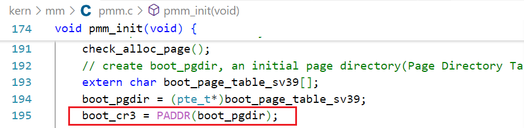
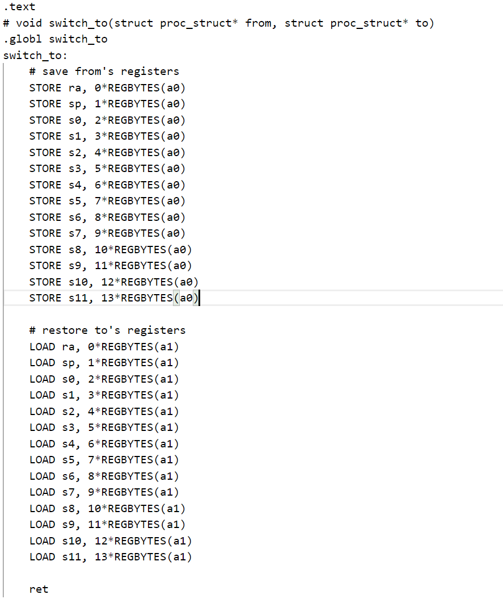

# Lab 4：进程管理

### 练习1：分配并初始化一个进程控制块（需要编码）

```c
proc->state = PROC_UNINIT;
proc->pid = -1;
proc->runs = 0;
proc->kstack = 0;
proc->need_resched = 0;
proc->parent = NULL;
proc->mm = NULL;
memset(&(proc->context),0,sizeof(proc->context));
proc->tf = NULL;
proc->cr3 = boot_cr3;
proc->flags = 0;
memset(proc->name,0,PROC_NAME_LEN);
```
* state:进程所处状态，通过这个字段，系统能够判断进程是否处于可以运行、等待资源或执行某些任务的状态，由于这个函数完成的是初始化任务因此将这个字段设置成`PROC_UNINIT`，表示处于初始化状态,该字段的其他枚举结果：
  ```c
  enum proc_state {
    PROC_UNINIT = 0,  // uninitialized
    PROC_SLEEPING,    // sleeping
    PROC_RUNNABLE,    // runnable(maybe running)
    PROC_ZOMBIE,      // almost dead, and wait parent proc to reclaim his resource
    }
  ```
* pid:这个字段保存进程的标识符，通常称为进程ID（PID）。每个进程在系统中都有一个唯一的PID，用于标识和管理该进程，因为是初始化状态，设置成一个无效值-1标识
* runs:字段记录进程运行的次数，初始化过程自然而然地设置为0
* kstack:这个字段保存进程的内核栈的地址，初始化状态这个信息未知，直接设置为0，表示成一个最原始的地址
* need_resched:这个字段表示该进程是否需要被重新调度，初始化阶段这个字段也将其初始化为0，表示当前不需要被重新调度
* parent:这个字段是指向父进程的指针，每个进程通常会有一个父进程，父进程负责创建和管理它的子进程，这个字段用于进程之间的关系追踪；初始化进程块不关心进程的父进程是谁，因此这个字段设置成NULL
* mm:这个字段指向进程的内存管理结构，如前面lab3，lab4中应用的伙伴系统等，但初始化进程对于这个信息不可知，也暂时不需要关心，因此也设置成NULL
* context:这个字段保存进程的上下文信息，进程调度时，操作系统通过保存和恢复上下文来实现进程的切换，初始化不关心上下文内容，但为了防止杂乱的原始信息干扰，将这个字段所占的空间全部刷0
* tf:字段保存进程的陷阱帧，触发中断异常时调用以保存寄存器状态，初始化阶段无法分配，因此也设置为NULL
* cr3:这个字段保存CR3寄存器的值，CR3是x86架构下用于指示当前进程的页目录表（PDT）基地址的寄存器，每个进程在x86系统上都有自己的页目录表，用于虚拟内存的映射，mm里有个很重要的项`pgdir`，记录的是该进程使用的一级页表的物理地址，但是在初始化阶段mm被定义为NULL，因此需要一个值来替代pgdir，`boot_cr3`指向了ucore启动时建立好的内核虚拟空间的页目录表首地址（在`pmm_init()`中初始化`boot_cr3`使之指向了ucore内核虚拟空间的页目录表首地址，即一级页表的起始物理地址），cr3字段存在的意义之一是避免每次都根据mm来计算cr3

* flags:这个字段保存进程的标志位。进程的标志位用于表示一些特殊的属性或状态，例如是否处于可中断状态、是否已经执行过某些操作等
* name:这个字段保存进程的名称，PROC_NAME_LEN是一个常量，指定了名称的最大长度，用于表示进程的标识符或描述符，通常在调试或查看进程状态时有很好的辅助作用，由于初始化位未知进程名字，这个字段全部空间刷0
##### 请说明proc_struct中`struct context context`和`struct trapframe *tf`成员变量含义和在本实验中的作用是啥？（提示通过看代码和编程调试可以判断出来）
###### struct context context
这个变量保存进程上下文内容，用于进程切换，在内核中进程是相对独立的。使用context保存寄存器状态可以使进程独立地进行上下文切换，实际使用这个变量进行上下文切换的函数时`kern/process/switch.S`中定义的`switch_to`：

###### struct trapframe *tf
tf是是一个中断帧的指针，总是指向内核栈的某个位置，当进程从用户空间跳到内核空间时，中断帧记录了**进程在被中断前的状态**。当内核需要跳回用户空间时，需要调整中断帧以恢复让进程继续执行的各寄存器值。除此之外，ucore 内核允许嵌套中断。因此为了保证嵌套中断发生时tf总是能够指向当前的`trapframe`,ucore 在内核桟上维护了 tf 的链;
下面是在trap处理时对于这个变量的具体应用：
```c
/* *lab4\kern\trap\trap.c
 * trap - handles or dispatches an exception/interrupt. if and when trap()
 * returns,
 * the code in kern/trap/trapentry.S restores the old CPU state saved in the
 * trapframe and then uses the iret instruction to return from the exception.
 * */
void trap(struct trapframe *tf) {
    // dispatch based on what type of trap occurred
    if ((intptr_t)tf->cause < 0) {
        // interrupts
        interrupt_handler(tf);
    } else {
        // exceptions
        exception_handler(tf);
    }
}
```
`tf->cause`表示触发陷阱的原因:
* 如果tf->cause为负值，表示这次陷阱是由**中断**引发的。
* 如果tf->cause为非负值，表示这次陷阱是由**异常**引发的。

*中断处理：*
```c
void interrupt_handler(struct trapframe *tf) {
    intptr_t cause = (tf->cause << 1) >> 1;     //为了实现处理cause的时候保留它的符号信息，确保当它是负数时，符号扩展后结果不会改变，确保负数在经过左移和右移操作后仍然保留其符号
    switch (cause) {
        case IRQ_U_SOFT:
            cprintf("User software interrupt\n");
            break;
        case IRQ_S_SOFT:
            cprintf("Supervisor software interrupt\n");
            break;
        case IRQ_H_SOFT:
            cprintf("Hypervisor software interrupt\n");
            break;
        case IRQ_M_SOFT:
            cprintf("Machine software interrupt\n");
            break;
        case IRQ_U_TIMER:
            cprintf("User software interrupt\n");
            break;
        case IRQ_S_TIMER:
            // "All bits besides SSIP and USIP in the sip register are
            // read-only." -- privileged spec1.9.1, 4.1.4, p59
            // In fact, Call sbi_set_timer will clear STIP, or you can clear it
            // directly.
            // clear_csr(sip, SIP_STIP);
            clock_set_next_event();
            if (++ticks % TICK_NUM == 0) {
                print_ticks();
            }
            break;
        case IRQ_H_TIMER:
            cprintf("Hypervisor software interrupt\n");
            break;
        case IRQ_M_TIMER:
            cprintf("Machine software interrupt\n");
            break;
        case IRQ_U_EXT:
            cprintf("User software interrupt\n");
            break;
        case IRQ_S_EXT:
            cprintf("Supervisor external interrupt\n");
            break;
        case IRQ_H_EXT:
            cprintf("Hypervisor software interrupt\n");
            break;
        case IRQ_M_EXT:
            cprintf("Machine software interrupt\n");
            break;
        default:
            print_trapframe(tf);
            break;
    }
}
```
*异常处理：*
```c
void exception_handler(struct trapframe *tf) {
    int ret;
    switch (tf->cause) {
        case CAUSE_MISALIGNED_FETCH:
            cprintf("Instruction address misaligned\n");
            break;
        case CAUSE_FETCH_ACCESS:
            cprintf("Instruction access fault\n");
            break;
        case CAUSE_ILLEGAL_INSTRUCTION:
            cprintf("Illegal instruction\n");
            break;
        case CAUSE_BREAKPOINT:
            cprintf("Breakpoint\n");
            break;
        case CAUSE_MISALIGNED_LOAD:
            cprintf("Load address misaligned\n");
            break;
        case CAUSE_LOAD_ACCESS:
            cprintf("Load access fault\n");
            if ((ret = pgfault_handler(tf)) != 0) {
                print_trapframe(tf);
                panic("handle pgfault failed. %e\n", ret);
            }
            break;
        case CAUSE_MISALIGNED_STORE:
            cprintf("AMO address misaligned\n");
            break;
        case CAUSE_STORE_ACCESS:
            cprintf("Store/AMO access fault\n");
            if ((ret = pgfault_handler(tf)) != 0) {
                print_trapframe(tf);
                panic("handle pgfault failed. %e\n", ret);
            }
            break;
        case CAUSE_USER_ECALL:
            cprintf("Environment call from U-mode\n");
            break;
        case CAUSE_SUPERVISOR_ECALL:
            cprintf("Environment call from S-mode\n");
            break;
        case CAUSE_HYPERVISOR_ECALL:
            cprintf("Environment call from H-mode\n");
            break;
        case CAUSE_MACHINE_ECALL:
            cprintf("Environment call from M-mode\n");
            break;
        case CAUSE_FETCH_PAGE_FAULT:
            cprintf("Instruction page fault\n");
            break;
        case CAUSE_LOAD_PAGE_FAULT:
            cprintf("Load page fault\n");
            if ((ret = pgfault_handler(tf)) != 0) {
                print_trapframe(tf);
                panic("handle pgfault failed. %e\n", ret);
            }
            break;
        case CAUSE_STORE_PAGE_FAULT:
            cprintf("Store/AMO page fault\n");
            if ((ret = pgfault_handler(tf)) != 0) {
                print_trapframe(tf);
                panic("handle pgfault failed. %e\n", ret);
            }
            break;
        default:
            print_trapframe(tf);
            break;
    }
}
```
根据tf保留的信息，对不同类型的异常进行处理，并输出日志内容

### 练习2：为新创建的内核线程分配资源（需要编码）

`do_fork` 函数用于实现进程的**创建**，即从父进程派生出一个子进程。它根据传入的参数来指导子进程的创建方式，并设置子进程的内核堆栈、内存空间以及运行状态。它类似于 Unix 系统中的 `fork` 调用，但增加了一些额外的灵活性，例如可以选择共享或复制内存空间。

#### 代码解析

##### 1. 分配并初始化进程控制块（`alloc_proc`函数）

```c
proc = alloc_proc();
if (proc == NULL) {
    goto fork_out;
}
```

- 调用 `alloc_proc` 创建一个新的 `proc_struct`（进程控制块），如果分配失败，返回错误码 `-E_NO_MEM`。

##### 2. 分配并初始化内核栈（`setup_stack`函数）

```c
if (setup_kstack(proc)) {
    goto bad_fork_cleanup_proc;
}
```

- `setup_kstack` 为子进程分配一块内核堆栈。如果失败，跳转到 `bad_fork_cleanup_proc` 进行错误处理，释放已分配的 `proc_struct`。

##### 3. 内存空间复制或共享

```c
if (copy_mm(clone_flags, proc)) {
    goto bad_fork_cleanup_kstack;
}
```

- `copy_mm` 根据 `clone_flags` 复制或共享父进程的内存空间：
  - 如果 `clone_flags & CLONE_VM` 为真，则共享内存空间。
  - 否则，为子进程创建独立的内存副本。
- 失败时，释放子进程的内核堆栈。

##### 4. 设置进程的中断帧和上下文（`copy_thread`函数）

```c
copy_thread(proc, stack, tf);
```

- `copy_thread` 将父进程的 `trapframe` 复制到子进程，并设置子进程的内核入口点和栈指针。
- 如果 `stack` 非零，则将其作为子进程的用户栈指针。

##### 5. 把设置好的进程加入链表

```c
proc->pid = get_pid();
hash_proc(proc);
list_add(&proc_list, &(proc->list_link));
nr_process++;
```

- 为子进程分配唯一的 `pid`。
- 将子进程插入两个全局结构：
  - `hash_list`：用于快速查找进程。
  - `proc_list`：存储所有进程的链表。
- 增加全局进程计数 `nr_process`。

##### 6. 将新建的进程设为就绪态

```c
wakeup_proc(proc);
```

- 将子进程的状态设置为 `PROC_RUNNABLE`，使其可以被调度运行。

##### 7. 返回新进程号

```c
ret = proc->pid;
```

- 将函数返回值设为子进程的 `pid`。

#### 错误处理

在子进程创建的各个阶段，如果出现错误，函数会按顺序清理已分配的资源：

- **释放内核堆栈**：
  ```c
  bad_fork_cleanup_kstack:
      put_kstack(proc);
  ```

- **释放进程控制块**：
  
  ```c
  bad_fork_cleanup_proc:
      kfree(proc);
  ```

#### 问题解答

> 请说明ucore是否做到给每个新fork的线程一个唯一的id？请说明你的分析和理由。

ucore使用的`get_pid` 函数就是为每个新创建的进程分配一个唯一的进程号。函数通过`last_pid`记录上一次分配的进程号，用`next_safe`表示目前可以安全分配的最大进程号。每次分配 pid 时，都会遍历全局进程链表 `proc_list`，确保 `last_pid` 未被任何现有进程占用，如果冲突则递增 `last_pid`，并重复检查。如果当前 `last_pid` 超过或等于 `next_safe`，则重新检查所有现存的进程，然后更新 `next_safe`，指向当前已分配的进程号中的最小未使用值。


### 练习3：编写`proc_run` 函数（需要编码）

`proc_run`函数的作用是将指定的进程切换到CPU上运行。其代码如下所示：

```c++
void
proc_run(struct proc_struct *proc) {
    if (proc != current) {  //如果要切换的进程不是当前正在运行的进程，才需要切换
        // LAB4:EXERCISE3 YOUR CODE
        /*
        * Some Useful MACROs, Functions and DEFINEs, you can use them in below implementation.
        * MACROs or Functions:
        *   local_intr_save():        Disable interrupts
        *   local_intr_restore():     Enable Interrupts
        *   lcr3():                   Modify the value of CR3 register
        *   switch_to():              Context switching between two processes
        */
        bool intr_flag;
        
        struct proc_struct *prev = current, *next = proc;   //设置prev指针和next指针指向当前进程和要切换的进程,

        local_intr_save(intr_flag); //禁用中断
        {
            current = proc;     //把要切换过去的进程记为当前进程
            lcr3(next->cr3);    //切换页表，以便使用新进程的地址空间
            switch_to(&(prev->context), &(next->context));  //实现两个进程的context切换
        }
        local_intr_restore(intr_flag);  //允许中断
    }
}
```

这段代码的逻辑是：

- 判断要切换的进程是否就是CPU当前运行的进程，如果不是才需要进行切换。
- 定义两个`proc_struct`指针，分别指向当前进程块和要切换的进程块。
- 使用`/kern/sync/sync.h`中定义好的宏`local_intr_save`禁用中断。
- 把要切换过去的进程记为当前进程
- 使用`/libs/riscv.h`中提供的`lcr3(unsigned int cr3)`函数，修改了cr3寄存器值，切换页表为新进程的页表，以便使用新进程的地址空间。
- 使用`/kern/process`中定义的`switch_to()`函数，实现从原进程到现进程的上下文切换。
- 使用`/kern/sync/sync.h`中定义好的宏`local_intr_restore`允许中断。

**问题：在本实验的执行过程中，创建且运行了几个内核线程？**

答：创建并运行了两个内核线程。

- `idleproc`线程：`idleproc`表示空闲线程。`idleproc`内核线程的工作就是不停地查询，看是否有其他内核线程可以执行了，如果有，马上让调度器选择那个内核线程执行。所以实际上它在`ucore`操作系统没有其他内核线程可执行的情况下才会被调用。主要目的是在系统没有其他任务需要执行时，占用 CPU 时间，同时便于进程调度的统一化。
- `initproc`线程：`initproc`内核线程的工作就是显示“Hello World”，表明自己存在且能正常工作了，证明我们的内核进程实现的没有问题。


### 扩展练习 Challenge：

- **说明语句`local_intr_save(intr_flag);....local_intr_restore(intr_flag);`是如何实现开关中断的？**

在`/kern/sync/sync.h`中定义了`local_intr_save(x)`和`local_intr_restore(x)`来实现关、开中断。具体代码如下所示：

```c++
static inline bool __intr_save(void) {
    if (read_csr(sstatus) & SSTATUS_SIE) {
        intr_disable();
        return 1;
    }
    return 0;
}

static inline void __intr_restore(bool flag) {
    if (flag) {
        intr_enable();
    }
}

#define local_intr_save(x) \
    do {                   \
        x = __intr_save(); \
    } while (0)
#define local_intr_restore(x) __intr_restore(x);

```

​	`local_intr_save(intr_flag)`语句首先在宏定义中调用了`__intr_save()` 函数，并将返回值赋给记录之前中断状态的`bool`变量`intr_flag`。而`__intr_save()` 函数首先使用`read_csr`函数读取了`CSR`寄存器的`sstatus`位，并检查`SSTATUS_SIE`是否被置位。如果`SSTATUS_SIE`被置位，则表示中断处于开启状态。这时调用`intr_disable()`关闭中断，并返回1，否则返回0。总而言之，如果中断之前是开启的，就关闭中断，`intr_flag`为真；如果之前中断是关闭的，`intr_flag`为假。

​	`local_intr_restore(intr_flag)`语句在宏定义中调用了`__intr_restore(x)`函数。该函数判断传入的`intr_flag`参数，如果为真，说明禁用中断前的中断状态是开启的，就调用`intr_enable()`函数开启中断；如果为假说明之前中断就是关闭的，不需要做额外操作。

