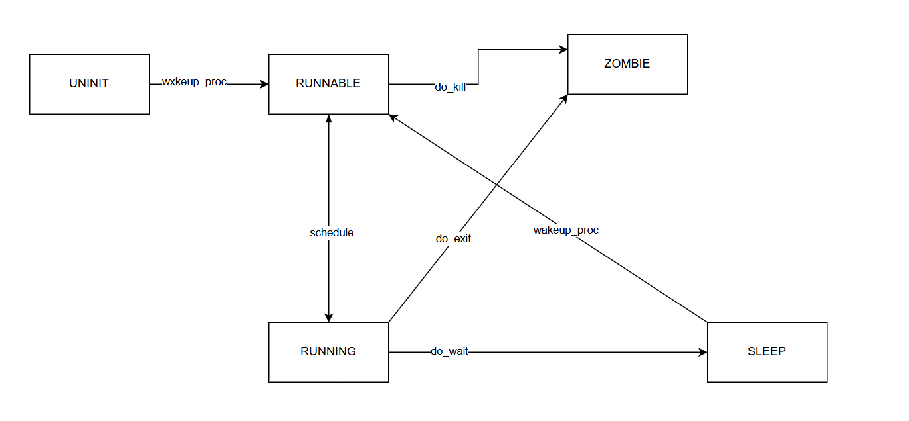

#### 练习1: 加载应用程序并执行（需要编码）

**`do_execv`**函数调用`load_icode`（位于`kern/process/proc.c`中）来加载并解析一个处于内存中的ELF执行文件格式的应用程序。你需要补充`load_icode`的第6步，建立相应的用户内存空间来放置应用程序的代码段、数据段等，且要设置好`proc_struct`结构中的成员变量`trapframe`中的内容，确保在执行此进程后，能够从应用程序设定的起始执行地址开始执行。需设置正确的`trapframe`内容。

请在实验报告中简要说明你的设计实现过程。

`load_icode`的第6步的代码补充如下，这段代码设置了应用进程的中断帧`trapframe`中的内容，确保在执行此进程后，能够从应用程序设定的起始执行地址开始执行。

- `tf->gpr.sp = USTACKTOP`：这句代码设置了用户栈顶。`tf->gpr.sp`是用户栈顶指针，`USTACKTOP`是用户栈的顶部地址，这样当进程返回用户态时，栈指针会指向正确的位置。
- `tf->epc = elf->e_entry`：这句代码设置了用户程序入口。`tf->epc`是用户程序的入口点，`elf->e_entry`是可执行文件（ELF格式）中指定的入口点地址，这样当进程返回用户态时，会从这个地址开始执行。
- `tf->status = (sstatus & ~SSTATUS_SPP) | SSTATUS_SPIE`：这行代码设置了中断帧的`status`字段，使其适用于用户程序，然后清除`SSTATUS_SPP`位并设置`SSTATUS_SPIE`位为1。
  - `SSTATUS_SPP`是`sstatus`寄存器中的一个位，用于指示当前模式是用户模式（0）还是特权模式（1）。这里将其清零，表示设置为用户模式。
  - `SSTATUS_SPIE`是`sstatus`寄存器中的一个位，用于指示是否启用中断。这里将其置为1，表示在用户模式下启用中断。

```C
//(6) setup trapframe for user environment
    struct trapframe *tf = current->tf;
    // Keep sstatus
    uintptr_t sstatus = tf->status;
    memset(tf, 0, sizeof(struct trapframe));
    /* LAB5:EXERCISE1 YOUR CODE
     * should set tf->gpr.sp, tf->epc, tf->status
     * NOTICE: If we set trapframe correctly, then the user level process can return to USER MODE from kernel. So
     *          tf->gpr.sp should be user stack top (the value of sp)
     *          tf->epc should be entry point of user program (the value of sepc)
     *          tf->status should be appropriate for user program (the value of sstatus)
     *          hint: check meaning of SPP, SPIE in SSTATUS, use them by SSTATUS_SPP, SSTATUS_SPIE(defined in risv.h)
     */
    tf->gpr.sp = USTACKTOP;  // 设置用户栈顶
    tf->epc = elf->e_entry;  // 设置用户程序入口
    tf->status = (sstatus & ~SSTATUS_SPP) | SSTATUS_SPIE;  // 设置状态为用户态
```


1. 请简要描述这个用户态进程被`ucore`选择占用CPU执行（RUNNING态）到具体执行应用程序第一条指令的整个经过。

   - 当操作系统的调度器从就绪进程队列中选择了一个就绪进程后，通过执行进程切换，就让这个被选上的就绪进程执行了，此时进程就处于运行（running）态了，此时程序进入`user_main`函数中。
   - `user_main`函数是`user_main`内核线程的入口点。在这个函数中，根据是否定义了`TEST`宏，它将执行`TEST`程序或`exit`程序。`KERNEL_EXECVE`和`KERNEL_EXECVE2`宏用于简化系统调用`sys_exec`的触发过程。这些宏封装了系统调用的参数，并使用内联汇编来触发`ebreak`异常，从而进入内核态执行系统调用sys_exec。
   - `sys_exec`中调用`do_execve`函数。`do_execve`函数被调用来加载用户程序。
     - 它首先清理当前进程的内存空间：如果mm不为NULL，则设置页表为内核空间页表，且进一步判断mm的引用计数减1后是否为0，如果为0，则表明没有进程再需要此进程所占用的内存空间，为此将根据mm中的记录，释放进程所占用户空间内存和进程页表本身所占空间。最后把当前进程的mm内存管理指针为空。
     - 然后调用`load_icode`函数，根据ELF格式的文件信息将用户程序加载到内存中。这里涉及到读ELF格式的文件，申请内存空间，建立用户态虚存空间，加载应用程序执行码等。
   - `load_icode`函数的主要工作就是给用户进程建立一个能够让用户进程正常运行的用户环境。
     - 初始化内存管理数据结构
     - 创建页目录表
     - 解析ELF格式
     - 分配物理内存并建立映射
     - 设置用户栈
     - 更新页目录表
     - 设置中断帧

   中断处理完毕后，通过`trapret`，CPU会切换回用户态，并开始执行用户进程的入口点处的第一条指令。

#### 练习2: 父进程复制自己的内存空间给子进程（需要编码）

创建子进程的函数`do_fork`在执行中将拷贝当前进程（即父进程）的用户内存地址空间中的合法内容到新进程中（子进程），完成内存资源的复制。具体是通过`copy_range`函数（位于`kern/mm/pmm.c`中）实现的，请补充`copy_range`的实现，确保能够正确执行。

请在实验报告中简要说明你的设计实现过程。

- 如何设计实现`Copy on Write`机制？给出概要设计，鼓励给出详细设计。

> Copy-on-write（简称COW）的基本概念是指如果有多个使用者对一个资源A（比如内存块）进行读操作，则每个使用者只需获得一个指向同一个资源A的指针，就可以该资源了。若某使用者需要对这个资源A进行写操作，系统会对该资源进行拷贝操作，从而使得该“写操作”使用者获得一个该资源A的“私有”拷贝—资源B，可对资源B进行写操作。该“写操作”使用者对资源B的改变对于其他的使用者而言是不可见的，因为其他使用者看到的还是资源A。
## 练习3: 阅读分析源代码，理解进程执行 fork/exec/wait/exit 的实现，以及系统调用的实现（不需要编码）
请在实验报告中简要说明你对 fork/exec/wait/exit函数的分析。并回答如下问题：

```js
SYS_exit        : process exit,                           -->do_exit
SYS_fork        : create child process, dup mm            -->do_fork-->wakeup_proc
SYS_wait        : wait process                            -->do_wait
SYS_exec        : after fork, process execute a program   -->load a program and refresh the mm
SYS_clone       : create child thread                     -->do_fork-->wakeup_proc
SYS_yield       : process flag itself need resecheduling, -- proc->need_sched=1, then scheduler will rescheule this process
SYS_sleep       : process sleep                           -->do_sleep 
SYS_kill        : kill process                            -->do_kill-->proc->flags |= PF_EXITING
                                                                 -->wakeup_proc-->do_wait-->do_exit   
SYS_getpid      : get the process's pid
```
### 系统调用的实现
四个功能的系统调用过程都十分相似，现在以exit举例说明这个过程
#### 用户态调用exit
```c
void
exit(int error_code) {
    sys_exit(error_code);
    cprintf("BUG: exit failed.\n");
    while (1);
}
```
如上，可以看到exit主要通过调用sys_exit函数来完成它的功能，接下来查看sys_exit的工作流程：
```c
int
sys_exit(int64_t error_code) {
    return syscall(SYS_exit, error_code);
}
```
如上sys_exit同样通过调用syscall函数完成，并返回syscall的返回值，现在查看syscall函数的工作流程：
```c
static inline int
syscall(int64_t num, ...) {
    va_list ap;
    va_start(ap, num);
    uint64_t a[MAX_ARGS];
    int i, ret;
    for (i = 0; i < MAX_ARGS; i ++) {
        a[i] = va_arg(ap, uint64_t);
    }
    va_end(ap);

    asm volatile (
        "ld a0, %1\n"
        "ld a1, %2\n"
        "ld a2, %3\n"
        "ld a3, %4\n"
        "ld a4, %5\n"
    	"ld a5, %6\n"
        "ecall\n"
        "sd a0, %0"
        : "=m" (ret)
        : "m"(num), "m"(a[0]), "m"(a[1]), "m"(a[2]), "m"(a[3]), "m"(a[4])
        :"memory");
    return ret;
}
```
`syscall`函数是一个通用的系统调用接口，它通过内联汇编将多个参数传递给内核，并调用系统调用处理程序（通过ecall进行）。返回值通过 a0 寄存器获取，并返回给用户程序（从这里要进入内核态的处理了，即体现了交叉运行的过程）。
* `num`这是传入的系统调用号，用于告诉内核要执行哪种系统调用，如sys_exit调用时传入的SYS_exit
* `sd a0, %0`、`: "=m" (ret)`将a0寄存器的值（即系统调用的返回值）存储到 ret 变量中，结束系统调用返回成为sys_exit函数返回给exit函数的返回值
至此用户态完成调用（其中蕴含内核态的处理过程）
#### 内核态调用exit
##### syscall
```c
void
syscall(void) {
    struct trapframe *tf = current->tf;
    uint64_t arg[5];
    int num = tf->gpr.a0;
    if (num >= 0 && num < NUM_SYSCALLS) {
        if (syscalls[num] != NULL) {
            arg[0] = tf->gpr.a1;
            arg[1] = tf->gpr.a2;
            arg[2] = tf->gpr.a3;
            arg[3] = tf->gpr.a4;
            arg[4] = tf->gpr.a5;
            tf->gpr.a0 = syscalls[num](arg);
            return ;
        }
    }
    print_trapframe(tf);
    panic("undefined syscall %d, pid = %d, name = %s.\n",
            num, current->pid, current->name);
}
```
内核系统调用函数syscall工作流程如下：
1. 获取当前进程在中断或异常发生时的寄存器状态
2. 从tf中获取a0寄存器的值，这个值就是系统调用号，告诉内核应该调用哪个系统调用处理函数，这个值其实就是用户态启动系统调用时设定的a0，也是传入的参数num，即SYS_exit（现在以exit举例）
3. 如果系统调用号num在合法的范围内（即 `0 <= num < NUM_SYSCALLS`），并且系统调用表中有对应的处理函数（syscalls[num] != NULL），则可以继续处理该系统调用
4. 将系统调用参数保存在a1到a5寄存器中，函数从tf中获取这些寄存器的值并存入arg数组
5. 通过num从 syscalls数组中查找对应的处理函数，并传递参数arg
6. 将系统调用处理函数的返回值会存储在a0寄存器中

`syscalls[]`是一个系统调用表，它存储了每个系统调用号对应的处理函数指针:
```c
static int (*syscalls[])(uint64_t arg[]) = {
    [SYS_exit]              sys_exit,
    [SYS_fork]              sys_fork,
    [SYS_wait]              sys_wait,
    [SYS_exec]              sys_exec,
    [SYS_yield]             sys_yield,
    [SYS_kill]              sys_kill,
    [SYS_getpid]            sys_getpid,
    [SYS_putc]              sys_putc,
    [SYS_pgdir]             sys_pgdir,
};
```
根据传入SYS_exit可以映射到具体的sys_exit中，现在查看sys_exit函数的工作流程：
```c
static int
sys_exit(uint64_t arg[]) {
    int error_code = (int)arg[0];
    return do_exit(error_code);
}
```
如上，可以看到sys_exit主要的工作就是从arg数组中提取第一个元素，即a1寄存器的值，这是进程的退出码，并调用do_exit函数。我注意到在用户态开始调用的时候也显式传入error_code，但在调用的时候似乎并不是通过这种传递调用的，而是直接访问对应的寄存器，使用寄存器中保存的值来实现退出码的识别。
现在对do_exit函数的工作进行考虑：`do_exit`函数的目的是处理进程的退出操作，具体来说，它负责清理进程的资源、更新进程状态，并通知父进程。由于这已经是整个系统调用的最后一步，在这一部分不详细讲解这个函数的具体实现，在exit实现中详细讲解这个函数。
### fork实现
实现fork的函数为`do_fork`,`do_fork`函数的目的是创建一个新的子进程，并且实现了进程的复制：
```c
int
do_fork(uint32_t clone_flags, uintptr_t stack, struct trapframe *tf) {
    int ret = -E_NO_FREE_PROC;
    struct proc_struct *proc;
    if (nr_process >= MAX_PROCESS) {    //检查当前进程数量是否已达到最大值 MAX_PROCESS。如果达到了最大值，则不能创建新进程，直接跳到 fork_out 退出
        goto fork_out;
    }
    ret = -E_NO_MEM;
    //    1. call alloc_proc to allocate a proc_struct
    proc = alloc_proc();        //通过调用 alloc_proc() 来分配一个新的进程结构体 proc_struct，它是进程的核心数据结构，包含了进程的各种状态信息。如果分配失败（proc == NULL），则跳到 fork_out 退出
    if (proc == NULL) // 如果分配失败，返回错误码
    { 
        goto fork_out;
    }
    //设置新进程的父进程为当前进程 current，表示新进程是当前进程的子进程。同时，检查当前进程的 wait_state 应为 0，确保当前进程没有被阻塞
    proc->parent=current;//添加
    assert(current->wait_state==0);
    //    2. call setup_kstack to allocate a kernel stack for child process
    //通过 setup_kstack(proc) 为新进程分配内核栈。内核栈用于执行进程中的内核代码（如系统调用）。如果分配失败，则跳转到 bad_fork_cleanup_proc，进行清理
    if (setup_kstack(proc))
    {
        goto bad_fork_cleanup_proc; // 释放刚刚alloc的proc_struct
    }
    //    3. call copy_mm to dup OR share mm according clone_flag
    // clone_flags 的标志，调用 copy_mm 来复制当前进程的内存空间
    if (copy_mm(clone_flags, proc))
    {
        //如果复制失败，则跳转到 bad_fork_cleanup_kstack，进行清理
        goto bad_fork_cleanup_kstack;  // 释放刚刚setup的kstack
    }
    //    4. call copy_thread to setup tf & context in proc_struct
    //调用 copy_thread 来复制当前进程的线程信息，设置线程的上下文和栈
    copy_thread(proc, stack, tf);
    //    5. insert proc_struct into hash_list && proc_list
    bool intr_flag;
    local_intr_save(intr_flag); //禁用中断
    {
        proc->pid = get_pid();//为新进程分配一个 PID
        hash_proc(proc);  // 插入hash_list
        set_links(proc);  // 设置进程间的关系
    }
    local_intr_restore(intr_flag);  //允许中断
    //    6. call wakeup_proc to make the new child process RUNNABLE
    wakeup_proc(proc);
    //    7. set ret vaule using child proc's pid
    ret = proc->pid;
fork_out:
    //返回新进程的 PID 或者错误代码
    return ret;

bad_fork_cleanup_kstack:
    put_kstack(proc);
bad_fork_cleanup_proc:
    kfree(proc);
    goto fork_out;
}
```
#### 调用过程
内核态：syscall -> sys_fork -> sys_fork -> do_fork
用户态：fork -> sys_fork -> syscall(SYS_fork)
### exec实现
在fork之后，进程执行一个程序，加载一个程序并刷新内存管理（mm），这个过程只在内核态中进行
user_main 是一个内核线程（kernel thread），它的主要职责是加载并执行一个用户程序,当内核启动时，它会创建一个名为 user_main 的内核线程。该线程的主要任务是加载并执行一个用户程序,下面的宏定义函数展示了如何一步步进入kernel_execve函数：
```c
static int
user_main(void *arg) {
#ifdef TEST
    KERNEL_EXECVE2(TEST, TESTSTART, TESTSIZE);
#else
    KERNEL_EXECVE(exit);
#endif
    panic("user_main execve failed.\n");
}
#define KERNEL_EXECVE(x) ({                                             \
            extern unsigned char _binary_obj___user_##x##_out_start[],  \
                _binary_obj___user_##x##_out_size[];                    \
            __KERNEL_EXECVE(#x, _binary_obj___user_##x##_out_start,     \
                            _binary_obj___user_##x##_out_size);         \
        })
#define __KERNEL_EXECVE(name, binary, size) ({                          \
            cprintf("kernel_execve: pid = %d, name = \"%s\".\n",        \
                    current->pid, name);                                \
            kernel_execve(name, binary, (size_t)(size));                \
        })
```
`kernel_execve`函数，用于在内核中执行一个用户程序,通过内联汇编来执行系统调用`SYS_exec`，并返回相应的执行结果:
```c
static int
kernel_execve(const char *name, unsigned char *binary, size_t size) {
    int64_t ret=0, len = strlen(name);
 //   ret = do_execve(name, len, binary, size);
    asm volatile(
        "li a0, %1\n"
        "lw a1, %2\n"
        "lw a2, %3\n"
        "lw a3, %4\n"
        "lw a4, %5\n"
    	"li a7, 10\n"
        "ebreak\n"
        "sw a0, %0\n"
        : "=m"(ret)
        : "i"(SYS_exec), "m"(name), "m"(len), "m"(binary), "m"(size)
        : "memory");
    cprintf("ret = %d\n", ret);
    return ret;
}
```
根据前文提到的系统调用表，这个系统调用号将会映射到sys_exec函数，这个函数会解析传入的数组的各个元素的值，并讲这些参数传递给`do_execve`函数，值得一提的是`arg[2]`是程序的二进制文件的起始地址，将其强制类型转换成`unsigned char *`后传递给`do_execve`函数
```c
static int
sys_exec(uint64_t arg[]) {
    const char *name = (const char *)arg[0];
    size_t len = (size_t)arg[1];
    unsigned char *binary = (unsigned char *)arg[2];
    size_t size = (size_t)arg[3];
    return do_execve(name, len, binary, size);
}
```
`do_execve`函数的主要功能，就是将一个用户程序的`elf`格式文件加载到当前进程的内存空间中，并且让该用户程序在用户空间运行起来
```c
int
do_execve(const char *name, size_t len, unsigned char *binary, size_t size) {
    struct mm_struct *mm = current->mm;
    if (!user_mem_check(mm, (uintptr_t)name, len, 0)) {     //这一步是检查用户传入的程序名称（name）在当前进程的地址空间内是否有效。函数 user_mem_check 会验证给定地址范围（从name开始，长度为 len）是否是有效的用户内存。如果检查失败，返回-E_INVAL
        return -E_INVAL;
    }
    if (len > PROC_NAME_LEN) {      //如果程序名称的长度大于最大允许长度 PROC_NAME_LEN，就将其限制为 PROC_NAME_LEN，以防越界
        len = PROC_NAME_LEN;
    }

    char local_name[PROC_NAME_LEN + 1];
    memset(local_name, 0, sizeof(local_name));
    memcpy(local_name, name, len);

    if (mm != NULL) {       //如果程序名称的长度大于最大允许长度 PROC_NAME_LEN，就将其限制为 PROC_NAME_LEN，以防越界
        cputs("mm != NULL");
        lcr3(boot_cr3);
        if (mm_count_dec(mm) == 0) {
            exit_mmap(mm);
            put_pgdir(mm);
            mm_destroy(mm);
        }
        current->mm = NULL;
    }
    int ret;
    if ((ret = load_icode(binary, size)) != 0) {        //这是加载程序二进制的函数，它将二进制文件从 binary（指向二进制数据的指针）加载到进程的地址空间中。size 表示二进制文件的大小。如果加载失败，返回非零值并跳转到 execve_exit 进行清理
        goto execve_exit;
    }
    set_proc_name(current, local_name);
    return 0;

execve_exit:
    do_exit(ret);
    panic("already exit: %e.\n", ret);
}
```
### wait实现
用户态：wait -> sys_wait -> syscall(SYS_wait, pid, store) -> 内核态……
内核态：
#### 用户态调用wait
```c
int
wait(void) {
    return sys_wait(0, NULL);
}
```
如上可以看到，wait是通过调用sys_wait函数实现其功能的，现在来分析sys_wait函数的工作流程：
```c
int
sys_wait(int64_t pid, int *store) {
    return syscall(SYS_wait, pid, store);
}
```
如上这一步和前面分析的系统调用过程一样，将进入内核态的调用
#### 内核态
根据系统调用表，用户态启动一个系统调用时，wait功能会跳转到sys_wait函数，
```c
static int
sys_wait(uint64_t arg[]) {
    int pid = (int)arg[0];
    int *store = (int *)arg[1];
    return do_wait(pid, store);
}
```

```c
int
do_wait(int pid, int *code_store) {
    struct mm_struct *mm = current->mm;
    if (code_store != NULL) {
        if (!user_mem_check(mm, (uintptr_t)code_store, sizeof(int), 1)) {
            return -E_INVAL;
        }
    }

    struct proc_struct *proc;
    bool intr_flag, haskid;
repeat:
    haskid = 0;
    if (pid != 0) {
        proc = find_proc(pid);
        if (proc != NULL && proc->parent == current) {
            haskid = 1;
            if (proc->state == PROC_ZOMBIE) {
                goto found;
            }
        }
    }
    else {
        proc = current->cptr;
        for (; proc != NULL; proc = proc->optr) {
            haskid = 1;
            if (proc->state == PROC_ZOMBIE) {
                goto found;
            }
        }
    }
    if (haskid) {
        current->state = PROC_SLEEPING;
        current->wait_state = WT_CHILD;
        schedule();
        if (current->flags & PF_EXITING) {
            do_exit(-E_KILLED);
        }
        goto repeat;
    }
    return -E_BAD_PROC;

found:
    if (proc == idleproc || proc == initproc) {
        panic("wait idleproc or initproc.\n");
    }
    if (code_store != NULL) {
        *code_store = proc->exit_code;
    }
    local_intr_save(intr_flag);
    {
        unhash_proc(proc);
        remove_links(proc);
    }
    local_intr_restore(intr_flag);
    put_kstack(proc);
    kfree(proc);
    return 0;
}
```
`do_wait`函数用于实现进程的等待功能:它的目标是让一个进程（通常是父进程）等待其子进程结束，并获取子进程的退出码,函数会检查进程的状态，如果子进程处于PROC_ZOMBIE（僵尸状态），则会回收该子进程;如果没有子进程，父进程会进入休眠状态，直到有子进程退出,具体工作流程如下：
1. 判断传入的存储退出代码的地址的指针是否有效，父进程可以通过该指针获取子进程的退出状态
2. `user_mem_check`函数用于检查`code_store`指向的地址是否在当前进程的有效用户空间内，如果地址无效，返回`-E_INVAL`
3. 查找子进程: 根据`pid`查找当前进程的子进程。如果pid为0，表示等待任意一个子进程（即当前进程的所有直接子进程）;`find_proc(pid)`根据`pid`查找进程,`current->cptr`表示当前进程的第一个子进程
4. 如果找到了子进程且其状态为`PROC_ZOMBIE`，表示子进程已经终止并准备被回收,此时跳转到`found`标签进行处理
   1. 判断进程类型，不允许等待idleproc（空闲进程）或initproc（初始化进程），如果尝试等待这些进程会导致系统崩溃，调用`panic`终止系统
   2. 如果`code_store`不为NULL，则将子进程的退出码存储到 `*code_store` 中
   3. 清理子进程：unhash_proc(proc): 从进程哈希表中移除子进程 -> remove_links(proc): 移除子进程在进程链表中的连接 -> put_kstack(proc): 释放子进程的内核栈 -> kfree(proc): 释放子进程的内存
   4. local_intr_restore(intr_flag): 恢复先前保存的中断状态,这个函数会根据`intr_flag`恢复先前保存的中断状态。也就是说，如果之前禁用了中断，它会重新启用中断；如果之前是启用中断的状态，它会保持中断处于启用状态
5. 如果没有找到任何可回收的子进程，且当前进程有子进程，父进程会进入休眠状态，等待子进程退出,设置`current->state = PROC_SLEEPING`和 `current->wait_state = WT_CHILD`表示当前进程正在等待子进程的退出
6. 调用调度器，切换到其他进程执行，直到有子进程退出或者当前进程被唤醒
### exit实现
由于前面对exit的分析已经十分充足，这部分补充exit实现中do_exit()的函数分析
#### do_exit()函数说明
真正完成exit过程的函数时do_exit，这个函数的完整定义如下：
函数的工作流程如下：
1. 判定当前进程的状态为**空闲进程**，是否为**初始化进程**；
2. 获取当前进程的虚拟内存管理结构`mm`；
3. `lcr3(boot_cr3)`切换到内核的页目录
4. 调用`mm_count_dec(mm)`递减内存管理结构的引用计数，若引用计数为0，表示没有其他进程在使用该内存，接下来就可以释放相关资源
5. （如果引用计数为0）释放进程的内存映射、页目录，`mm_destroy(mm)`销毁内存管理结构，完全清理当前进程的内存资源
6. 将当前进程的内存结构指针置为NULL
7. 将当前进程的状态设为“僵尸进程”（PROC_ZOMBIE）,表示进程已经退出
8. 设置当前进程的退出代码,即这个函数的传入参数
9. `local_intr_save(intr_flag)` 和 `local_intr_restore(intr_flag)`函数保存和恢复中断标志，确保在调整进程状态时不会被中断打断
10. 获取当前进程的父进程，检查父进程是否在等待子进程结束，如果父进程在等待，就唤醒父进程，使其继续执行
11. cptr 指针链表遍历当前进程的所有子进程，并将这些子进程转交给初始化进程管理
12. 调用调度程序切换到下一个进程。当前进程已经准备好退出，调度程序会选择另一个进程来运行
```c
int
do_exit(int error_code) {
    if (current == idleproc) {
        panic("idleproc exit.\n");
    }
    if (current == initproc) {
        panic("initproc exit.\n");
    }
    struct mm_struct *mm = current->mm;
    if (mm != NULL) {
        lcr3(boot_cr3);
        if (mm_count_dec(mm) == 0) {
            exit_mmap(mm);
            put_pgdir(mm);
            mm_destroy(mm);
        }
        current->mm = NULL;
    }
    current->state = PROC_ZOMBIE;
    current->exit_code = error_code;
    bool intr_flag;
    struct proc_struct *proc;
    local_intr_save(intr_flag);
    {
        proc = current->parent;
        if (proc->wait_state == WT_CHILD) {
            wakeup_proc(proc);
        }
        while (current->cptr != NULL) {
            proc = current->cptr;//获取当前进程的第一个子进程
            current->cptr = proc->optr;//将子进程从当前进程的子进程链表中移除，并更新 cptr 指针
    
            proc->yptr = NULL;//将子进程的父进程指针置为 NULL，表示它不再属于当前进程
            if ((proc->optr = initproc->cptr) != NULL) {        //将子进程的 optr 指向初始化进程的第一个子进程
                initproc->cptr->yptr = proc;//更新初始化进程的子进程指针链表，使子进程成为初始化进程的一个子进程
            }
            proc->parent = initproc;//将子进程的父进程指针设为初始化进程
            initproc->cptr = proc;//将初始化进程的子进程指针指向新的子进程
            if (proc->state == PROC_ZOMBIE) {   
                if (initproc->wait_state == WT_CHILD) {
                    wakeup_proc(initproc);//如果子进程是僵尸进程，且初始化进程的 wait_state 是 WT_CHILD，就唤醒初始化进程
                }
            }
        }
    }
    local_intr_restore(intr_flag);
    schedule();
    panic("do_exit will not return!! %d.\n", current->pid);
}
```
#### do_exit调用过程
kernel_execve -> ebreak -> syscall -> sys_exec -> do_execve -> do_exit
### 请给出ucore中一个用户态进程的执行状态生命周期图（包执行状态，执行状态之间的变换关系，以及产生变换的事件或函数调用）。（字符方式画即可）

### 执行：make grade。如果所显示的应用程序检测都输出ok，则基本正确。（使用的是qemu-1.0.1）

#### 扩展练习 Challenge

1. 实现 Copy on Write （COW）机制

   给出实现源码,测试用例和设计报告（包括在cow情况下的各种状态转换（类似有限状态自动机）的说明）。

   这个扩展练习涉及到本实验和上一个实验“虚拟内存管理”。在ucore操作系统中，当一个用户父进程创建自己的子进程时，父进程会把其申请的用户空间设置为只读，子进程可共享父进程占用的用户内存空间中的页面（这就是一个共享的资源）。当其中任何一个进程修改此用户内存空间中的某页面时，ucore会通过page fault异常获知该操作，并完成拷贝内存页面，使得两个进程都有各自的内存页面。这样一个进程所做的修改不会被另外一个进程可见了。请在ucore中实现这样的COW机制。

   由于COW实现比较复杂，容易引入bug，请参考 https://dirtycow.ninja/ 看看能否在ucore的COW实现中模拟这个错误和解决方案。需要有解释。

   这是一个big challenge.

2. 说明该用户程序是何时被预先加载到内存中的？与我们常用操作系统的加载有何区别，原因是什么？
